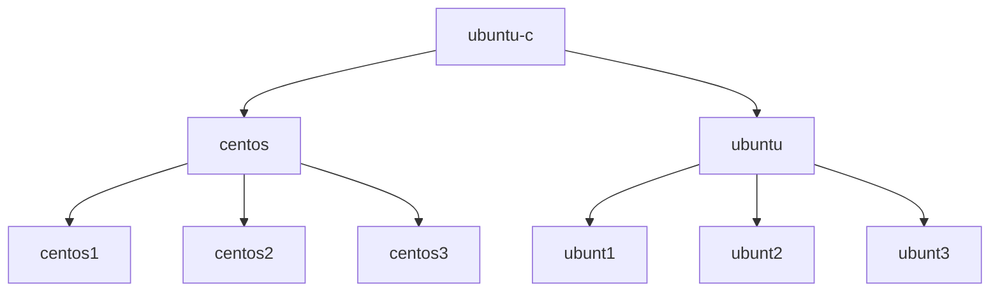
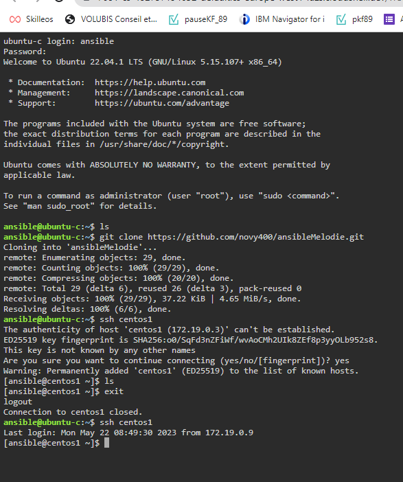
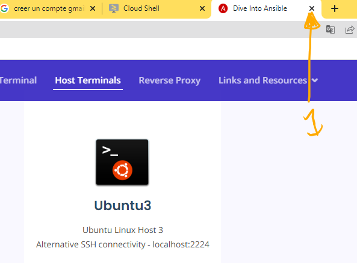

# Tutorial 1 Mise en place et Visite du lab. 
## Table des matières
- [Objectifs](#objectifs)  
- [Ressources](#ressources)
- [Pré-Requis](#pré-requis)  
## Objectifs  
- Mettre en place le laboratoire permettant d'utiliser Ansible sur Google Shell.
- Découvrir le lab et l'infrastructure.
- S'approprier l'usage de google Shell terminal et éditeur.
- Savoir sauvegarder son travail.
- Contrôler l'environnement d'execution du lab.	
## Ressources
- Environnement 
- Temps : 30 mn.
## Pré-Requis
- Avoir un compte Google (gmail par exemple) 
    TODO: procedure de creation de compte google.
    [créer un compte GMAIL](https://support.google.com/mail/answer/56256?hl=fr)
- Accéder à internet.
- Chrome 

## Énoncé  
1. se Connecter sur le [playGround de DiveInto](https://diveinto.com/p/playground)  
  
  
  

1. désactiver le mode "éphémère" pour conserver vos travaux entre deux sessions.  
  
  
1. lancer les 3 scripts  
  
jusqu'au message de fin ....  
  
 les machines "linux" sont lancées.  
1. Ouvrir l'interface web  
  
1. Ouvrir un shell sur le poste de contrôle (control node)  
  
profil : ansible et mote de passe : password  
  
1. cloner le dépôt GIT  "ansibleMelodie"  
`git clone https://github.com/novy400/ansibleMelodie.git`  
  
1. lancer l’éditeur  
  
1. ouvrir le fichier README.MD du noeud de contrôle ubuntu-c 
/home/yvieville/diveintoansible-lab/ansible_home/ubuntu-c/ansible/ansibleMelodie/README.md
  

Nous avons créé un environnement complet 7 machines sous linux.

la machine **ubuntu-c** sera notre noeud de contrôle.  
Nous travaillerons sur celui-ci pour executer des taches sur les autres machines via ansible.
Ansible est installé.
Et depuis la console d'ubuntu-c nous pouvons accéder aux autres machines via ssh en utilisant une clé (sans saisir le profil et le mot de passe)
  
1. vérifier la présence ansible  
`ansible --version`
1. connecter vous à la machine centos1 via ssh  
`ssh centos1` 

1. pour sortir de l'environnement 
    1. fermer les machines linux
      
    1. fermer les fenêtres du lab
      
    1. arrêter les machines (docker ) via la touche CTRL-C dans le cloud shell
      

    1. puis fermer l’éditeur et le terminal
      
      
    1. reprendre le travail en rouvrant un session  
    [cloud shell](https://shell.cloud.google.com/?show=terminal)  
    puis relancer la commande suivant dans le terminal  
    `cd ${HOME}/diveintoansible-lab; bin/docker-compose up --quiet-pull`
    1. voir son quotas d’utilisation 
      

      

## Conclusion et feed-back  

## Correction  

# 💡💡💡💡Idées 
- 