# Tutorial 1 Mise en place et Visite du lab. 
## Table des matières
- [Objectifs](#objectifs)  
- [Ressources](#ressources)
- [Pré-Requis](#pré-requis)  
## Objectifs  
- Mettre en place le laboratoire permettant d'utiliser Ansible sur Google Shell.
- Découvrir le lab et l'infrastructure.
- S'approprier l'usage de google Shell terminal et éditeur.
- Savoir sauvegarder son travail.
- Contrôler l'environnement d'execution du lab.	
## Ressources
- Environnement 
- Temps : 45 mn.
## Pré-Requis
- Avoir un compte Google (gmail par exemple) 
    [créer un compte GMAIL](https://support.google.com/mail/answer/56256?hl=fr)
- Accéder à internet.
- Chrome 

## Énoncé  
1. se Connecter sur le [playGround de DiveInto](https://diveinto.com/p/playground)  
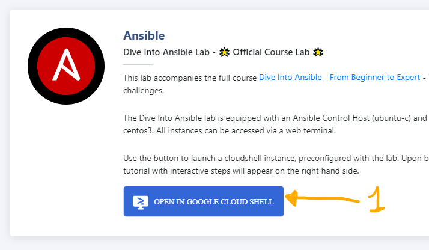  
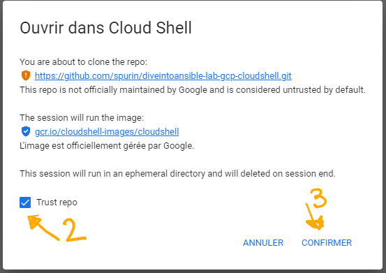  
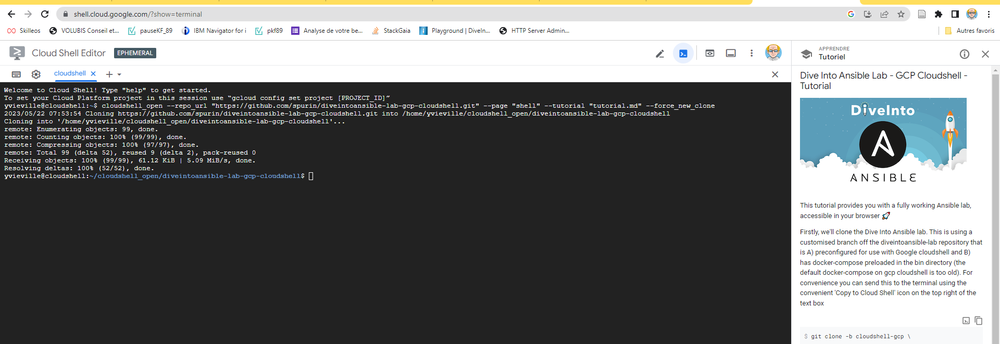  

1. désactiver le mode "éphémère" pour conserver vos travaux entre deux sessions.  
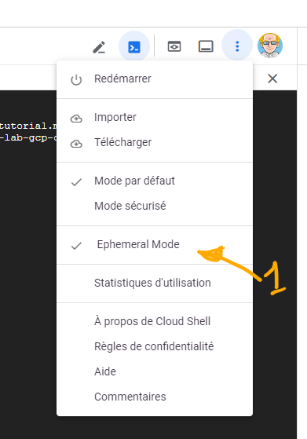  
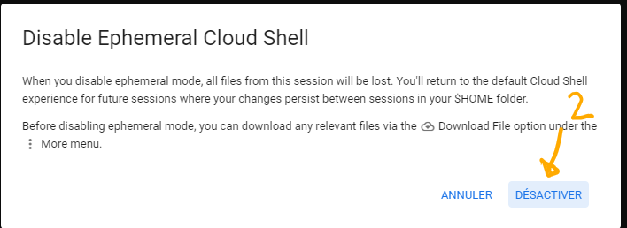  
1. lancer les 3 scripts  
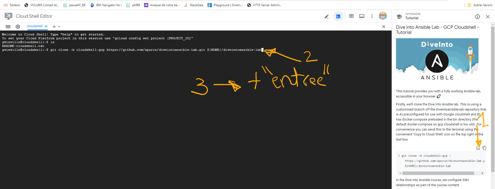  
jusqu'au message de fin ....  
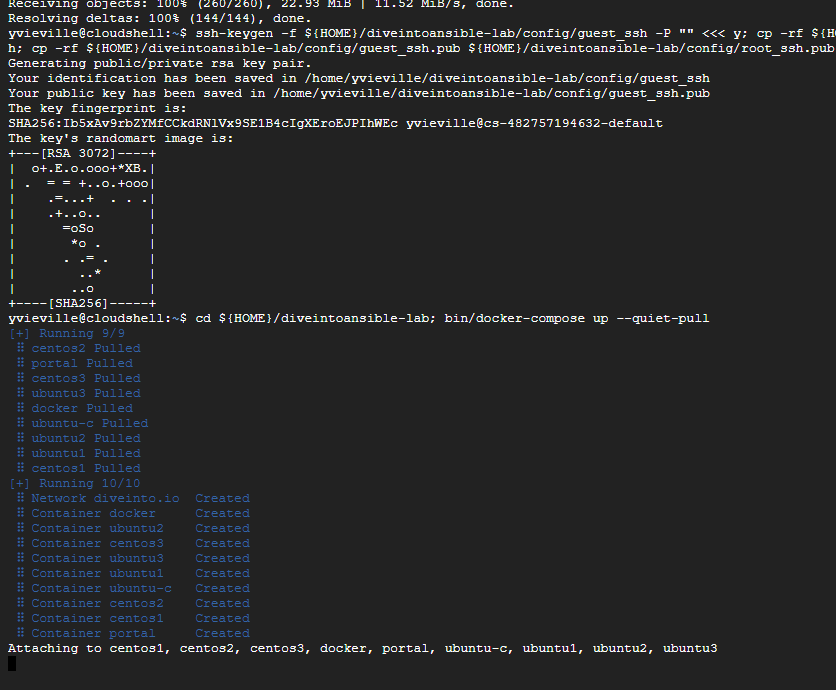  
Nous avons créé un environnement complet 7 machines sous linux.
et les 7 machines "linux" sont lancées. 
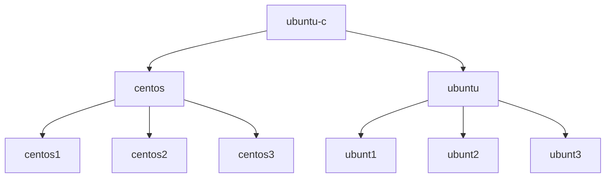
1. Ouvrir l'interface web  
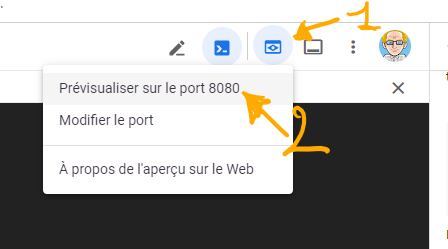  
1. Ouvrir un shell sur le poste de contrôle (control node)  
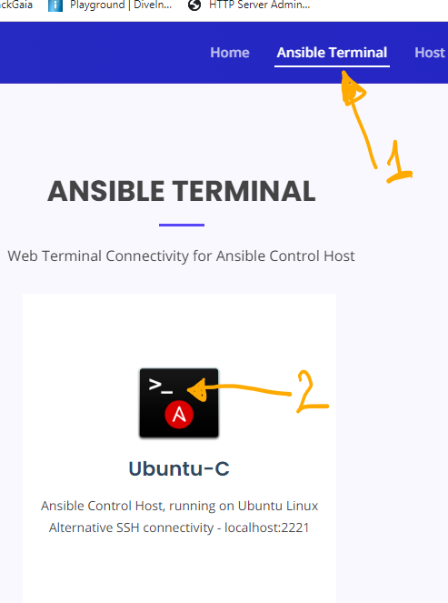  
profil : ansible et mot de passe : password  
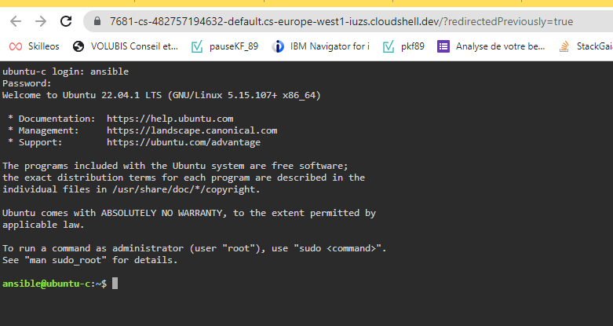  
1. cloner le dépôt GIT  "ansibleMelodie"  

`git clone https://github.com/novy400/ansibleMelodie.git`  
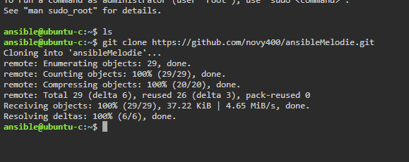 

vous pouvez faire un copie/coller (Ctr+C/ctrl+maj+V) mais cela rajoute des caractères à supprimer.
- pour verifier `ls`   

## Consultation d'un fichier
1. retourner le cloud shell DiveINTO et lancer l’éditeur  
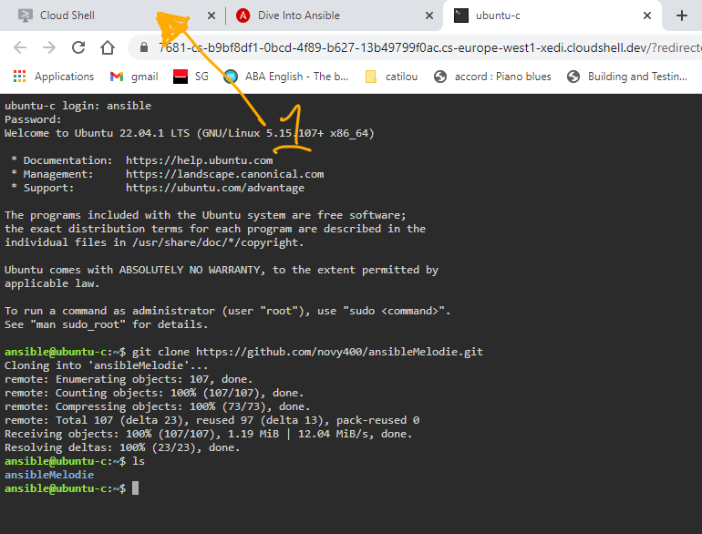  

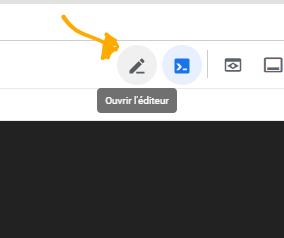  
1. ouvrir le fichier README.MD du noeud de contrôle ubuntu-c 
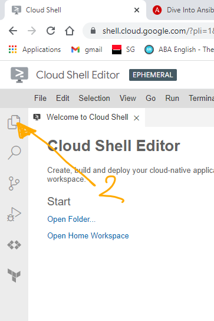  
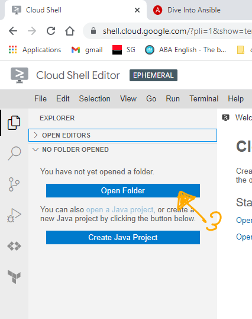 
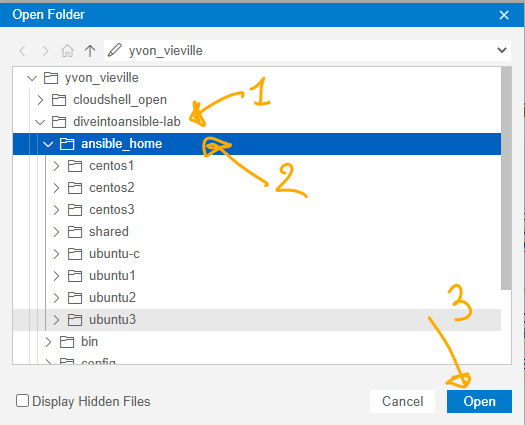  
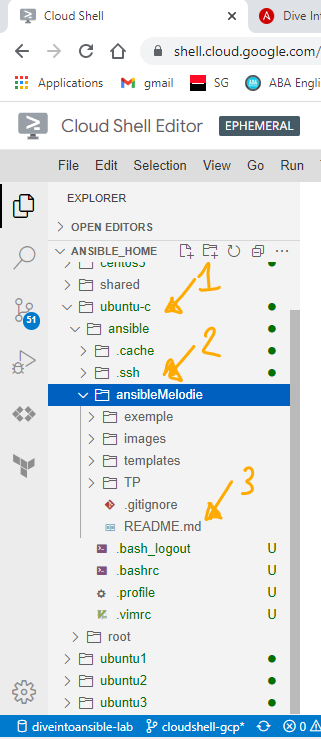  
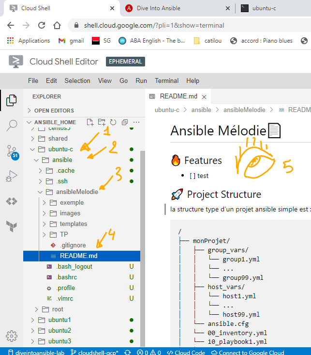  

/home/\<votreCompte\>/diveintoansible-lab/ansible_home/ubuntu-c/ansible/ansibleMelodie/README.md

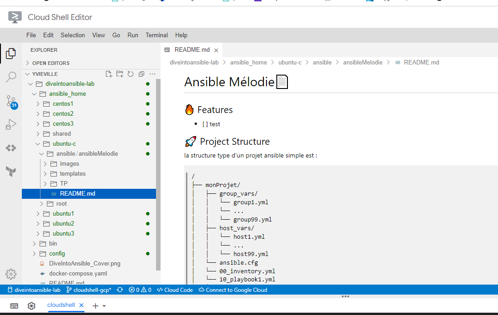  

## Création et edition d'un fichier 
1. creation d'un dossier de travail \<myWork\>  
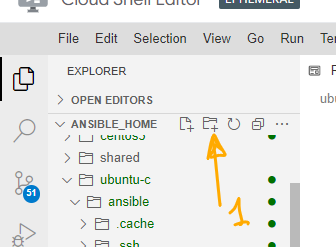  
 

🧐 penser à vérifier le dossier !  
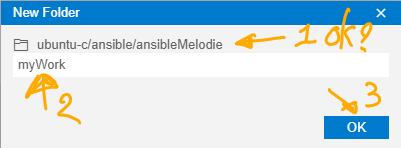  

1. Création du fichier \<test.txt\>  
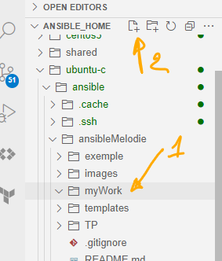  
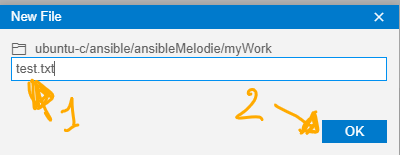  
- 😉libre cours à votre inspiration !  
  

- contrôle dans ubuntu-c
    1. Ouvrez la console d'ubuntu-c
    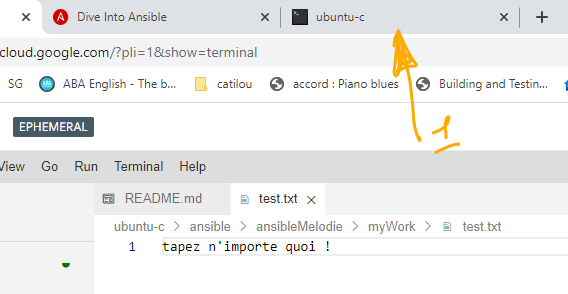  
    1. tapez dans le shell  
    `cat ~/ansibleMelodie/myWork/test.txt`
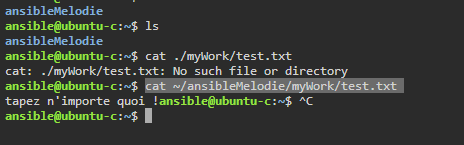  
 

## Découvrons notre environnement 
Nous avons créé un environnement complet 7 machines sous linux.

la machine **ubuntu-c** sera notre noeud de contrôle.  
Nous travaillerons sur celui-ci pour executer des taches sur les autres machines via ansible.  
Ansible est installé.  
Et depuis la console d'ubuntu-c nous pouvons accéder aux autres machines via ssh en utilisant une clé (sans saisir le profil et le mot de passe)
### Testons une connexion SSH  
1. se connecter à centos1  
    - tapez dans le shell d'ubuntu-c  
        `ssh centos1`  
    - répondez au message par yes   
        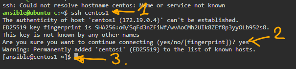  
    - vous êtes connecté sur Centos1 ! 
1. se déconnecter de centos1   
    - tapez dans le shell d'ubuntu-c   
        `exit`
    - vous êtes de retour sur ubuntu-c !  
        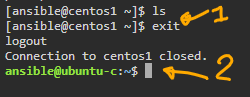  
  
### Vérifions la présence ansible  sur ubuntu-c  
`ansible --version`
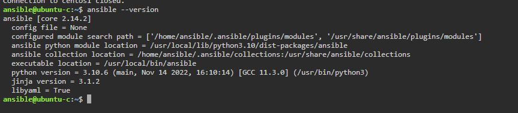  

### Fermons l'environnement
⚠ Nous avons des quotas d'utilisation (50 heure/semaine je crois)
Il est donc important de bien fermer sa session le soir par exemple....

1. fermer les consoles linux  
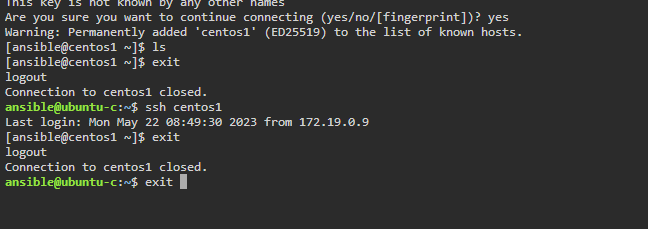  
1. fermer les fenêtres du lab
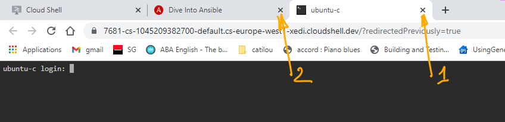  

1. arrêter les machines (docker ) via la touche CTRL-C dans le cloud shell
    - ouvrez le cloud shell
    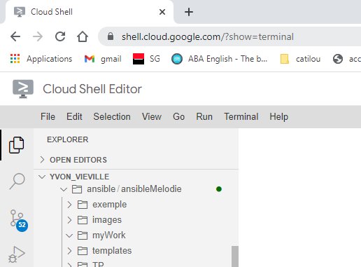  
    - placer dans le shell en cliquant dans la zone noire du shell  
    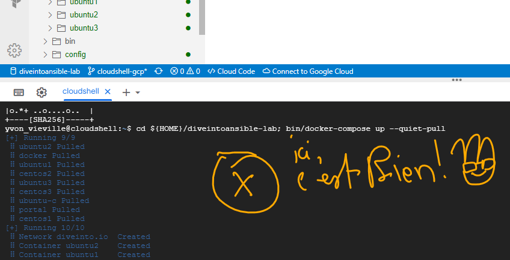  
    - tapez sur les touches CTRL-C
    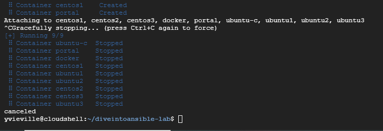  

1. puis fermer l’éditeur et le terminal  
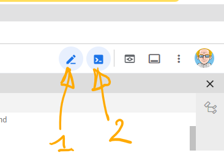  
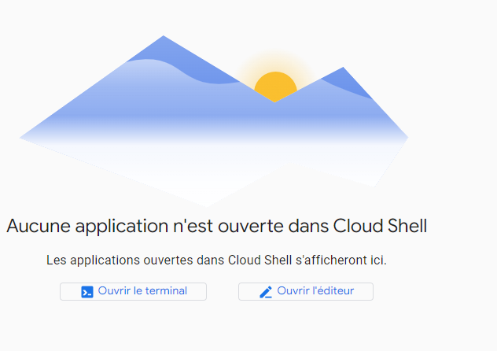  
### reprendre le travail en rouvrant un session  
1. [cloud shell](https://shell.cloud.google.com/?show=terminal)  
1. relancer le lab
    - tapez la commande suivante dans le terminal  
    `cd ${HOME}/diveintoansible-lab; bin/docker-compose up --quiet-pull`
1. rouvrez notre fichier test.txt  
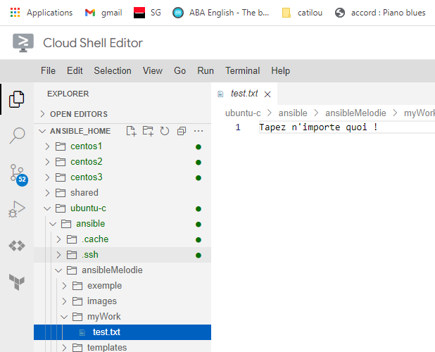  
Ouf il est bien là ! 

## voir son quota d’utilisation  
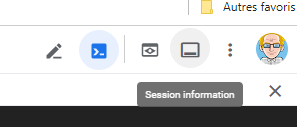  

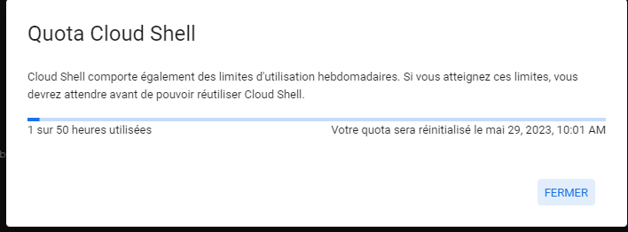  

## Conclusion et feed-back  

## Correction  

# 💡💡💡💡Idées 
- 