# Tutorial 2 Configuration d'Ansible.  
## Table des matières
- [Objectifs](#objectifs)  
- [Ressources](#ressources)
- [Pré-Requis](#pré-requis)  
## Objectifs  
Pour notre premier TP, nous allons travailler avec un template de projet. (simple cad sans utiliser les rôles).
Cela nous permettra de nous familiariser avec les concepts clés d'Ansible.

Ainsi nous allons :  
- Éditer un fichier de configuration.  
- Tester notre configuration avec la commande ansible-config.  
- Écrire un fichier d'inventaire pour cataloguer notre infrastructure.  
- Tester notre inventaire avec la commande ansible-inventory.  
- Utiliser le module Ping en mode commande pour tester notre inventaire.  
- Utiliser le module Debug en mode commande pour tester nos variables d'inventaire.  

## Ressources
- Environnement 
- Temps : 60 mn.
## Pré-Requis
- avoir mis en place l'environnement dans cloud shell.  
    [TP01 - Mise en place du Lab](../01_MiseEnPlace_LAB/README.md01_MiseEnPlace_LAB/README.md)

## Énoncé  
## Etape 1 Initier le projet TP01 
- dans l'éditeur créer un nouveau dossier dans myWork du control-node ubuntu-c.
Ce sera notre repertoire de travail pour ce TP.
### Etape 2 Configurer Ansible.
On peut spécifier des preferences de configuration dans le fichier ansible.cfg.  
Celui ci peut se retrouver à plusieurs endroits,mais il est fortement conseillé de le placer dans le repertoire du projet.  
1. tester la configuration actuelle.  
    - Nous allons utiliser la commande ansible-config pour connaître la configuration. 
    - Ouvrer un terminal sur Ubuntu-c avec le profil ansible/password.
    - Placer vous dans notre repertoire de travail.  
    `cd ~/ansibleMelodie/myWork/TP01`
    - afficher le fichier de configuration utilisé.  
    `ansible-config --version`
    - afficher la configuration utilisée.  
    `ansible-config view`
1. copiez le fichier ansible.cfg  du projet template via la commande dans le terminal.   
`cp ../../templates/ansible_simple/ansible.cfg ansible.cfg`
1. visualiser ce fichier dans l'éditeur.
    - Nous conservons les valeurs par défaut.
    - Nous ne contrôlons pas l'empreinte de la cible lors d'une connexion SSH.  
1. tester la configuration actuelle.  
    - Nous allons utiliser la commande ansible-config pour connaître la configuration. 
    - afficher le fichier de configuration utilisé.  
    `ansible-config --version`
    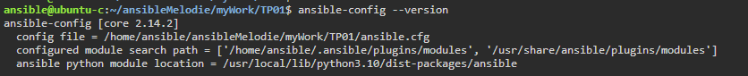  

    - afficher la configuration utilisée.  
    `ansible-config view`
    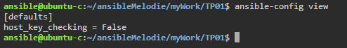  

### Etape 3 Configurons nos machines hôtes.  
Le fichier d'inventaire permet de cataloguer notre infrastructure.  
Il permet de lister les différentes machines hôtes que l'on veut administer.  
1. copiez le fichier 00_inventory.yml du projet template via la commande dans le terminal.   
`cp ../../templates/ansible_simple/00_inventory.yml 00_inventory.yml`
1. Affichez le contenu du fichier 00_inventory.yml  
1. tester la configuration actuelle de nos machines hôtes.  
    - Nous allons utiliser la commande ansible-inventory pour connaître la configuration. 
    - afficher les hôtes inscrits dans l'inventaire.  
      `ansible-inventory -i 00_inventory.yml --list --yaml`  
      ou 
      ✔ `ansible-inventory -i 00_inventory.yml --graph`  
  
1. tester la connexion vers nos machines hôtes.
    - Nous allons le module ping pour se connecter à nos hôtes.  
    - Consulter la [documentation Ansible](https://docs.ansible.com/ansible/latest/collections/ansible/builtin/ping_module.html)  
    - Ce module envoie un ping à l'hôte et reçoit en retour un pong si tout va bien.
    - faire du ping/pong avec les hôtes inscrits.  
      `ansible -i 00_inventory.yml all -m ping`  
      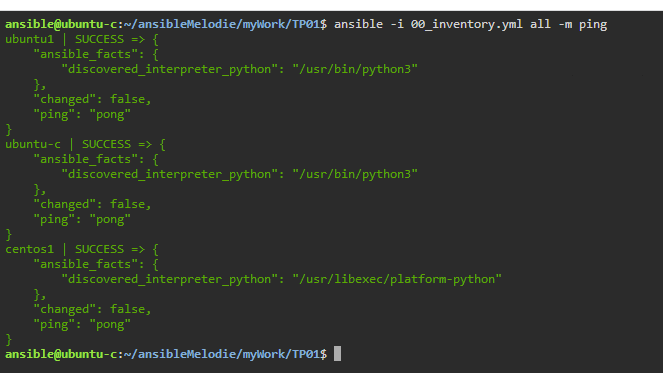  
        - nous pouvons spécifier un hôte particulier 
       `ansible -i 00_inventory.yml centos1 -m ping`
        - un group  
       `ansible -i 00_inventory.yml ubuntu -m ping` 
Comme vous pouvez le remarquer nous n'avons pas paramétré toutes les machines hôtes.  
Nous allons le faire maintenant.
1. Modifier le fichier d'inventaire pour ajouter les hôtes manquants à savoir 
    - ubuntu2 et unbuntu3
    - centos2 et centos3
1. Tester votre configuration  
[correction](../02_ConfigurerAnsible/TP/correction/01/00_inventory.yml)

### Etape 3 Configurons les variables de nos machines hôtes.
Le fichier d'inventaire permet de cataloguer notre infrastructure.
Il permet de lister les différentes machines hôtes que l'on veut administer.
Il permet aussi de paramétrer nos actions sur les hôtes au moyen de variables.
Ces variables peuvent se trouver dans le fichier d'inventaire.
Mais en général on préfère les stocker dans les repertoires group_vars et host_vars.
1. Ajout d'une variable pour tous les hôtes.
    1. via l’éditeur créer un dossier \<group_vars\> et un sous-dossier all  
    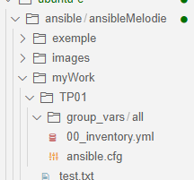  
    1. dans le dossier all créer un fichier variables.yml
    1. dans ce fichier inscrivez une variable  
        - nom : maVariable
        - valeur : all 
    1. sauvegarder     
    1. tester la configuration actuelle de nos machines hôtes.  
        - Nous allons utiliser la commande ansible-inventory pour connaître la configuration. 
        - afficher les hôtes inscrits et leurs variables.  
        `ansible-inventory -i 00_inventory.yml --graph --vars`  
        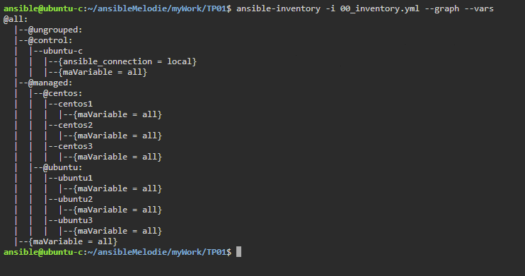  
    1. tester les variables transmises à nos machines hôtes.
        - Nous allons le module debug pour se verifier sur nos hôtes.
        - Consulter la [documentation Ansible](https://docs.ansible.com/ansible/latest/collections/ansible/builtin/debug_module.html)      
        - Ce module permet d'afficher le contenu d'une variable sur une machine hôtes ou un message utilisant un langage de templates jinga2.
        - afficher le contenu de maVariable sur les hôtes inscrits.  
        `ansible -i 00_inventory.yml all -m debug -a 'var=maVariable'`  
        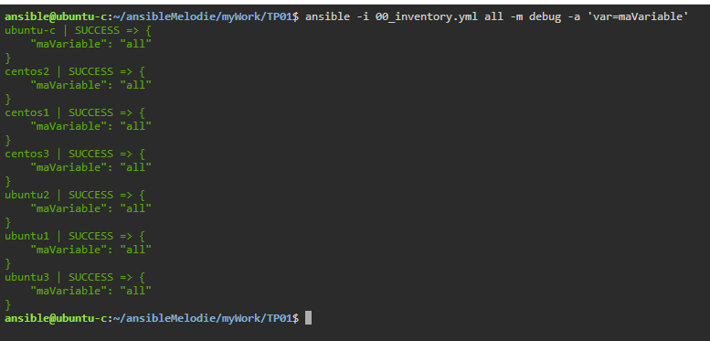  
        - afficher un message avec le contenu de maVariable sur les hôtes inscrits.  
        `ansible -i 00_inventory.yml all -m debug -a "msg='le contenu de ma variable est {{ maVariable }}.'"`  
        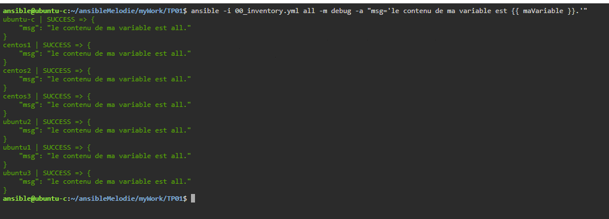  
1. Ajouter de ma même façon une variable pour tous les hôtes du group centos.  
   - nom : maVariable  
   - valeur : centos  
   1. créer un dossier centos dans group_vars et un fichier maVariable.yml dans centos.  
    noter que le nom du fichier n'a pas d'importance..  
   1. tester la configuration actuelle de nos machines hôtes.
   1. tester les variables transmises à nos machines hôtes.  
   [correction](../02_ConfigurerAnsible/TP/correction/02/')
1. Ajout d'une variable l'hôte ubuntu1.
    1. via l’éditeur créer un dossier \<host_vars\> et un sous-dossier ubuntu1  
    1. dans le dossier ubuntu1 créer un fichier variables.yml
    1. dans ce fichier inscrivez une variable  
        - nom : maVariable
        - valeur : ubuntu1
    1. sauvegarder  
      
   1. tester la configuration actuelle de nos machines hôtes.
   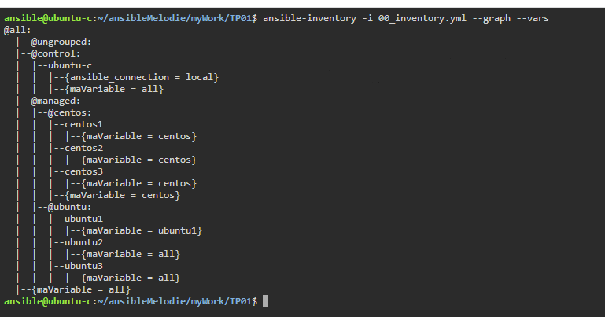  

   1. tester les variables transmises à nos machines hôtes.   
    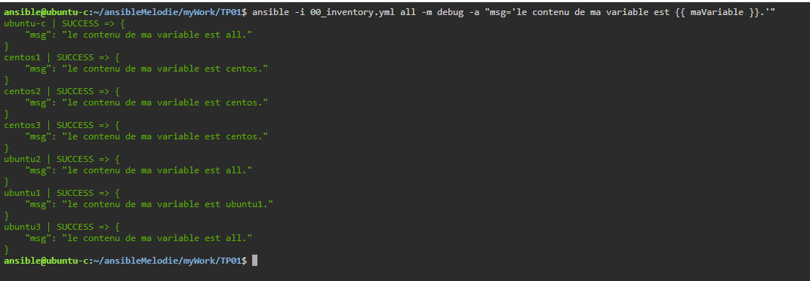  
1. Ajouter de ma même façon une variable pour l'hôte centos2.  
   - nom : maVariable  
   - valeur : centos2  
   1. créer un dossier centos2 dans host_vars et un fichier maVariable.yml dans centos2.  
    noter que le nom du fichier n'a pas d'importance..  
   1. tester la configuration actuelle de nos machines hôtes.
   1. tester les variables transmises à nos machines hôtes.  
   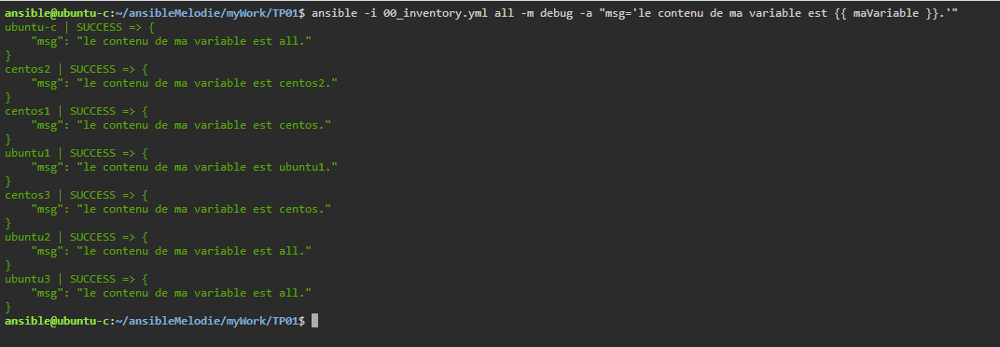  
    [correction](../02_ConfigurerAnsible/TP/correction/03/')
   1. ajouter une variable mavariable2 avec le contenu que vous voulez dans le fichier maVariable de centos2 et retester. 
   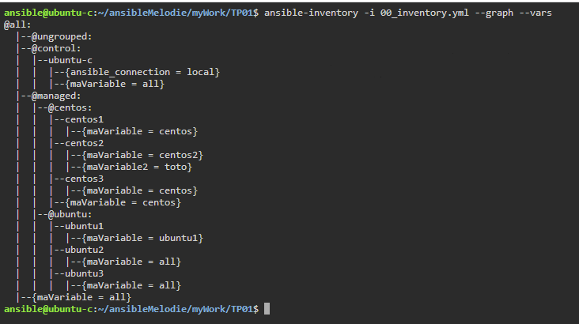  

## Conclusion et feed-back  

## Correction  

# 💡💡💡💡Idées 
- 