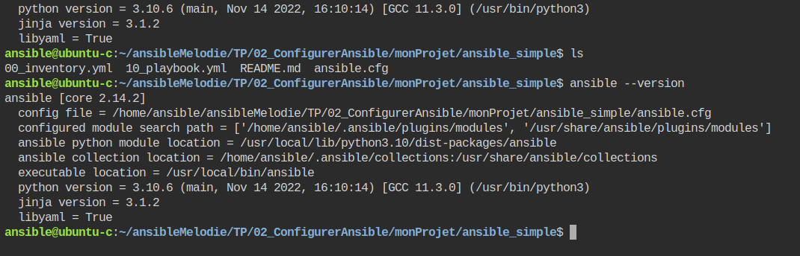

# Tutorial 3 Création du premier playbook.    
## Table des matières
- [Objectifs](#objectifs)  
- [Ressources](#ressources)
- [Pré-Requis](#pré-requis)  
## Objectifs  
Dans ce TP ,nous allons créer notre premier playbook.
Un playbook permet de regrouper des tâches à réaliser sur nos machines hôtes.
Nous allons utiliser avec un template de projet. (simple cad sans utiliser les rôles).
Cela nous permettra de nous familiariser avec les concepts clés d'Ansible.

Ainsi nous allons : 
- Écrire un fichier d'inventaire pour cataloguer notre infrastructure.
- Éditer un fichier de configuration.
- Utiliser le module Ping en mode commande pour tester notre inventaire.
- Utiliser la commande doc pour afficher la liste des modules disponibles.
- Retrouver la documentation du module debug.
- 	
## Ressources 
- Environnement 
- Temps : 60 mn.
## Pré-Requis
- avoir mis en place l'environnement dans cloud shell .

## Énoncé  
### Etape 1 Configurer Ansible.
On peut configurer et spécifier des preferences dans le fichier ansible.cfg.
Celui ci peut se retrouver à plusieurs endroits,mais il est fortement conseillé de le faire dans le repertoire du projet.
1. copiez le projet template en utilisant la commande.
`cp -R templates ./TP/02_ConfigurerAnsible/monProjet`
ou en utilisant l'éditeur
1. placez vous de le dossier nouvellement créé et lancez la commande 
`ansible --version`
  

Nous pouvons savoir quel fichier de configuration est utilisé par ansible. 
1. Ouvrez le fichier ansible.cfg et verfier le conetnue de la variable **inventory**.
Ce paramétre indique à ansible que est l'inventaire à utilser lorsqu'il n'est pas précisé dans la commande lancée.

### Etape 2 Inventorier notre infrastructure.
Le fichier d'inventaire permet de cataloguer notre infrastructure.
Il permet de lister les différentes machines hôtes que l'on veut administer.
Il permet aussi de paramétrer nos différents au moyen de variables.
Ces variables peuvent se trouver dans le fichier d'inventaire.
Mais en général on préfère les stocker dans les repertoires group_vars et host_vars. 
1. Affichez le contenu du fichier 00_inventory.yml   
    


tapez les commandes suivantes : 
```console
ansible all --list-hosts
ansible control --list-hosts
ansible centos --list-hosts
ansible centos1 --list-hosts
ansible centos2 --list-hosts
ansible -i "./00_inventory.yml" all  --list-hosts
```
Comme vous pouvez le remarquer nous n'avons pas paramétré toutes les machines hôtes. Nous allons le faire maintenantpar la suite.
1. Editer le fichier d'inventaire pour les ajouter, puis tester votre travail. 
### Etape 3 Tester notre inventaire.
Nous allons utiliser un module simple mais trés utile pour vérifier nos connexions.
tapez les commandes suivantes : 
```console
ansible all -mp ping
ansible control -m ping
ansible centos -m ping
ansible centos4 -m ping
ansible -i "centos1,centos4," all -m ping
```
  
  


### Etape 4 Afficher la liste des modules 
Ansible contient un grand nombre de module.
Vous pouvez accéder à la liste des modules via la commande
`ansible-doc -l`
- déplacer vous dans la liste via les flèches (⏬⏫)vers le bas et vers le haut
- quitter la liste en tapant q en bas à gauche    
- filtrer via la commande 
`ansible-doc -l | grep -i ping`
  

- afficher le détail del'aide via la commande  
`ansible-doc ansible.builtin.ping`
  
mais google reste votre ami ! 
[doc ansible en ligne module ping](https://docs.ansible.com/ansible/latest/collections/ansible/builtin/ping_module.html)
- remarquer les exemples dans la doc en ligne très utile lorsqu'on débute 

### Etape 5 facultatif Tester le module setup en vous aidant de la Documentation  
FIXME: voir pour faire un exemple en utilisant en copy un fichier 
le noeud de contrôle récupère de nombreuse valeur de configuration des machines hôtes on les appelle les gather facts.
ce module s'appelle setup.
- Retrouver grace à la documentation une commande qui permettrait d'afficher les distributions respectives des machines hôtes.
- Regarder tout particulièrement dans les exemples.
pour passer un paramètre dans la commande il faut écrire -a 'nomParamètre=valeurParamètre' par exemple ansible -m toto -a 'filter=toto' all 
`ansible -m setup -a 'filter=ansible_distribution' all `


## Conclusion et feed-back  

## Correction  


# 💡💡💡💡Idées 
- 