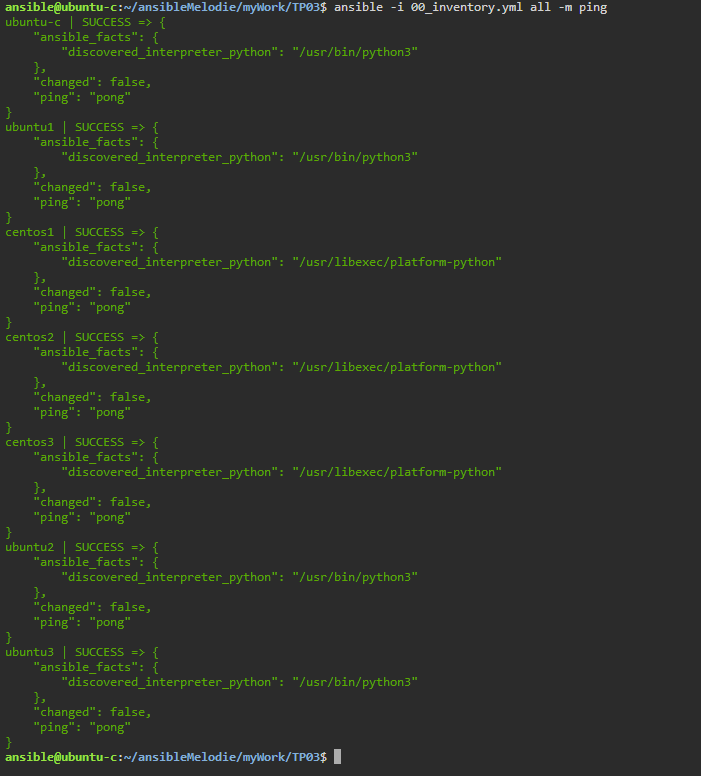
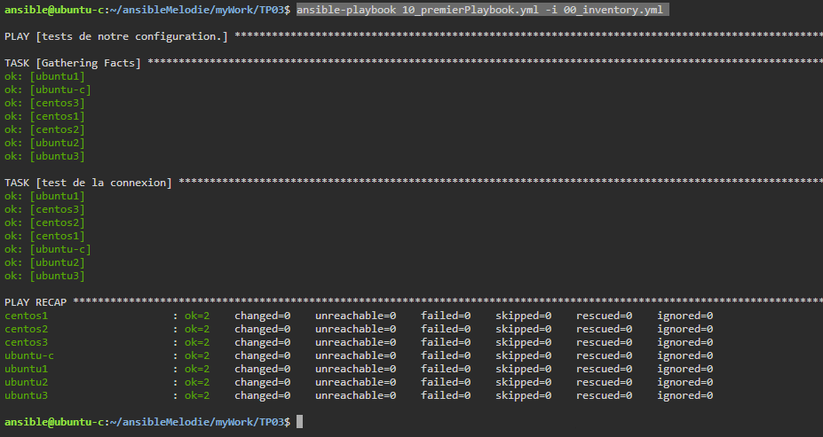
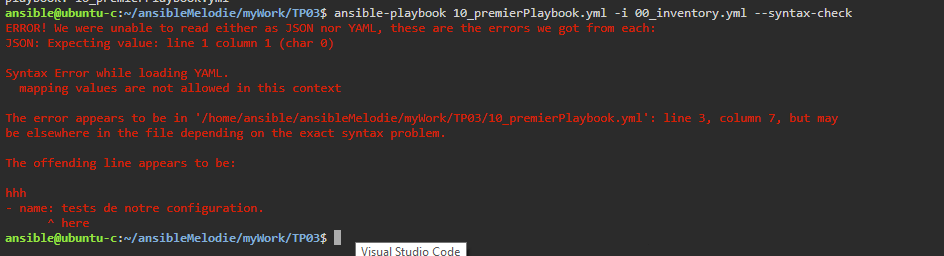
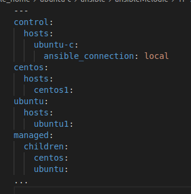
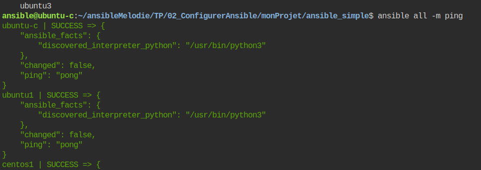
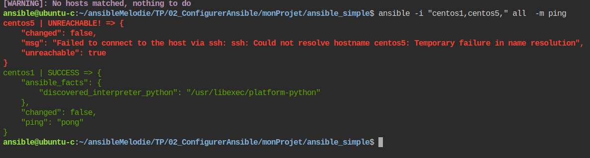
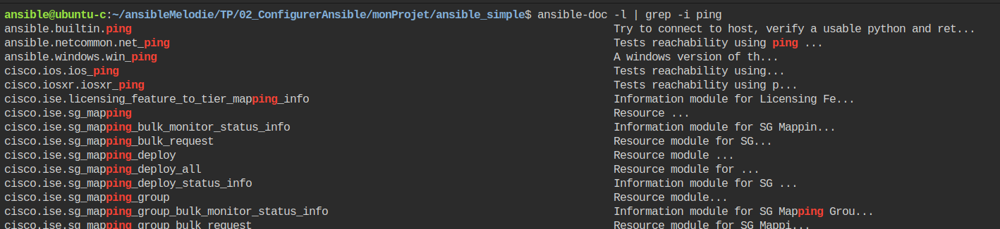
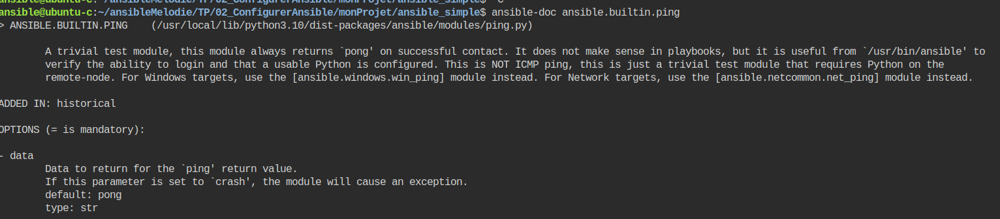

# Tutorial 3 Création du premier playbook.    
## Table des matières
- [Objectifs](#objectifs)  
- [Ressources](#ressources)
- [Pré-Requis](#pré-requis)  
## Objectifs  
Dans ce TP ,nous allons créer notre premier playbook.
Un playbook permet de regrouper des tâches à réaliser sur nos machines hôtes.

Ainsi nous allons : 
- Créer un playbook basique en utilisant le module ping et debug utilisé dans le TP02.
- Le lancer.
- Analyser les résultats.
- Ajouter un tache de création  de fichier avec file pour tester l'idempotence
- 	
## Ressources 
- Environnement 
- Temps : 60 mn.
## Pré-Requis
- avoir mis en place l'environnement dans cloud shell.  
    [TP01 - Mise en place du Lab](../01_MiseEnPlace_LAB/README.md01_MiseEnPlace_LAB/README.md)  
- avoir configurer Ansible pour travailler avec notre environnement dans cloud shell.  
    [TP02 - Configurer Ansible](../02_ConfigurerAnsible/README.md) 

## Énoncé  
### Etape 1 création du projet TP03 dans myWork.
On peut configurer et spécifier des preferences dans le fichier ansible.cfg.
Celui ci peut se retrouver à plusieurs endroits,mais il est fortement conseillé de le faire dans le repertoire du projet.
1. copiez le projet TP02 en TP03.
depuis la console d'ubuntu-c
```bash
cd /home/ansible/ansibleMelodie/myWork
cp -R ./TP02 TP03
```
ou copie dans solution [correction](../03_PremierPlaybook/TP/correction/01/')

1. placez vous de le dossier nouvellement créé et tester les connexions.
    - faire du ping/pong avec les hôtes inscrits.  
      `ansible -i 00_inventory.yml all -m ping`  
      
1. copiez le fichier playbook 10_playbook.yml du projet template dans notre projet via la commande dans le terminal.   
```bash
cp ../../templates/ansible_simple/10_playbook.yml 10_premierPlaybook.yml
```
1. création du jeu 
    - dans le fichier 10_premierPlaybook remplacer :
   ```yaml
   ---
   # Les documents YAML commencent par le séparateur de document ---
   # Le moins (-) dans YAML indique un élément de liste.
   # Le playbook contient une liste de "jeu".
   # Chaque jeu étant un dictionnaire.
   - name: le nom de mon jeu 
   # Hosts: les systèmes cibles où notre jeu s'exécutera et les options avec lesquelles il s'exécutera
     hosts:
   # Vars: Les variables qui s'appliqueront à ce jeu, sur tous les systèmes cibles
   ```
   par 
   ```yaml
   ---
   - name: tests de notre configuration.
     hosts: all
   ```
   içi nous indiquons que notre jeu s'appelle "tests de notre configuration" et qu'il doit être joué sur toutes nos machines (control et managed node).  
   👁‍🗨remarquer que nous n'avons pas indiqué de variables puisque nous le faisons avec les dossiers d'inventaire (group_vars et hosts_vars).
1. création de la tache pour tester la connexion. 
    - dans le fichier 10_premierPlaybook remplacer :
   ```yaml
    # Tasks: la liste des tâches qui seront exécutées dans ce jeu.
    tasks:
      - name: nom de la tâche
   ```
   par 
   ```yaml
    tasks:
      - name: test de la connexion
        ping:
   ```
⚠ faites très attention à l'indentation Ansible et le format yaml sont très sensible.  
👁‍🗨Préférez les espaces pour indenter (deux espaces) à la touche de tabulation.
ou copie dans solution [correction](../03_PremierPlaybook/TP/correction/02/')
1. lancer votre playbook.  
`ansible-playbook 10_premierPlaybook.yml -i 00_inventory.yml`  
  
1. verifier la syntaxe de votre playbook.
`ansible-playbook 10_premierPlaybook.yml -i 00_inventory.yml --syntax-check`
    - ajouter une erreur de syntaxe et relancer la commande
      
      

### Etape 2 Inventorier notre infrastructure.
Le fichier d'inventaire permet de cataloguer notre infrastructure.
Il permet de lister les différentes machines hôtes que l'on veut administer.
Il permet aussi de paramétrer nos différents au moyen de variables.
Ces variables peuvent se trouver dans le fichier d'inventaire.
Mais en général on préfère les stocker dans les repertoires group_vars et host_vars. 
1. Affichez le contenu du fichier 00_inventory.yml   
    


tapez les commandes suivantes : 
```console
ansible all --list-hosts
ansible control --list-hosts
ansible centos --list-hosts
ansible centos1 --list-hosts
ansible centos2 --list-hosts
ansible -i "./00_inventory.yml" all  --list-hosts
```
Comme vous pouvez le remarquer nous n'avons pas paramétré toutes les machines hôtes. Nous allons le faire maintenantpar la suite.
1. Editer le fichier d'inventaire pour les ajouter, puis tester votre travail. 
### Etape 3 Tester notre inventaire.
Nous allons utiliser un module simple mais trés utile pour vérifier nos connexions.
tapez les commandes suivantes : 
```console
ansible all -mp ping
ansible control -m ping
ansible centos -m ping
ansible centos4 -m ping
ansible -i "centos1,centos4," all -m ping
```
  
  


### Etape 4 Afficher la liste des modules 
Ansible contient un grand nombre de module.
Vous pouvez accéder à la liste des modules via la commande
`ansible-doc -l`
- déplacer vous dans la liste via les flèches (⏬⏫)vers le bas et vers le haut
- quitter la liste en tapant q en bas à gauche    
- filtrer via la commande 
`ansible-doc -l | grep -i ping`
  

- afficher le détail del'aide via la commande  
`ansible-doc ansible.builtin.ping`
  
mais google reste votre ami ! 
[doc ansible en ligne module ping](https://docs.ansible.com/ansible/latest/collections/ansible/builtin/ping_module.html)
- remarquer les exemples dans la doc en ligne très utile lorsqu'on débute 

### Etape 5 facultatif Tester le module setup en vous aidant de la Documentation  
FIXME: voir pour faire un exemple en utilisant en copy un fichier 
le noeud de contrôle récupère de nombreuse valeur de configuration des machines hôtes on les appelle les gather facts.
ce module s'appelle setup.
- Retrouver grace à la documentation une commande qui permettrait d'afficher les distributions respectives des machines hôtes.
- Regarder tout particulièrement dans les exemples.
pour passer un paramètre dans la commande il faut écrire -a 'nomParamètre=valeurParamètre' par exemple ansible -m toto -a 'filter=toto' all 
`ansible -m setup -a 'filter=ansible_distribution' all `


## Conclusion et feed-back  

## Correction  


# 💡💡💡💡Idées 
- 