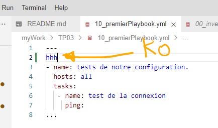

# Tutorial 3 Création du premier playbook.    
## Table des matières
- [Objectifs](#objectifs)  
- [Ressources](#ressources)
- [Pré-Requis](#pré-requis)  
## Objectifs  
Dans ce TP ,nous allons créer notre premier playbook.
Un playbook permet de regrouper des tâches à réaliser sur nos machines hôtes.

Ainsi nous allons : 
- Créer un playbook basique en utilisant le module ping et debug utilisé dans le TP02.
- Le lancer.
- Analyser les résultats.
- Ajouter un tache de création  de fichier avec file pour tester l'idempotence
- 	
## Ressources 
- Environnement 
- Temps : 60 mn.
## Pré-Requis
- avoir mis en place l'environnement dans cloud shell.  
    [TP01 - Mise en place du Lab](../01_MiseEnPlace_LAB/README.md01_MiseEnPlace_LAB/README.md)  
- avoir configurer Ansible pour travailler avec notre environnement dans cloud shell.  
    [TP02 - Configurer Ansible](../02_ConfigurerAnsible/README.md) 

## Énoncé  
### Etape 1 création du projet TP03 dans myWork.
On peut configurer et spécifier des preferences dans le fichier ansible.cfg.
Celui ci peut se retrouver à plusieurs endroits,mais il est fortement conseillé de le faire dans le repertoire du projet.
1. copiez le projet TP02 en TP03.
depuis la console d'ubuntu-c
```bash
cd /home/ansible/ansibleMelodie/myWork
cp -R ./TP02 TP03
```
ou copie dans solution [correction](../03_PremierPlaybook/TP/correction/01/')

1. placez vous de le dossier nouvellement créé et tester les connexions.
    - faire du ping/pong avec les hôtes inscrits.  
      `ansible -i 00_inventory.yml all -m ping`  
      
1. copiez le fichier playbook 10_playbook.yml du projet template dans notre projet via la commande dans le terminal.   
```bash
cp ../../templates/ansible_simple/10_playbook.yml 10_premierPlaybook.yml
```
### Etape 2 Testons nos connexions dans un playbook avec le module PING.
1. création du jeu 
    - dans le fichier 10_premierPlaybook remplacer :
   ```yaml
   ---
   # Les documents YAML commencent par le séparateur de document ---
   # Le moins (-) dans YAML indique un élément de liste.
   # Le playbook contient une liste de "jeu".
   # Chaque jeu étant un dictionnaire.
   - name: le nom de mon jeu 
   # Hosts: les systèmes cibles où notre jeu s'exécutera et les options avec lesquelles il s'exécutera
     hosts:
   # Vars: Les variables qui s'appliqueront à ce jeu, sur tous les systèmes cibles
   ```
   par 
   ```yaml
   ---
   - name: tests de notre configuration.
     hosts: all
   ```
   içi nous indiquons que notre jeu s'appelle "tests de notre configuration" et qu'il doit être joué sur toutes nos machines (control et managed node).  
   👁‍🗨remarquer que nous n'avons pas indiqué de variables puisque nous le faisons avec les dossiers d'inventaire (group_vars et hosts_vars).
1. création de la tache pour tester la connexion. 
    - dans le fichier 10_premierPlaybook remplacer :
   ```yaml
    # Tasks: la liste des tâches qui seront exécutées dans ce jeu.
    tasks:
      - name: nom de la tâche
   ```
   par 
   ```yaml
    tasks:
      - name: test de la connexion
        ping:
   ```
⚠ faites très attention à l'indentation Ansible et le format yaml sont très sensible.  
👁‍🗨Préférez les espaces pour indenter (deux espaces) à la touche de tabulation.
ou copie dans solution [correction](../03_PremierPlaybook/TP/correction/02/')  
1. lancer votre playbook.  
`ansible-playbook 10_premierPlaybook.yml -i 00_inventory.yml`  
  
1. verifier la syntaxe de votre playbook.
`ansible-playbook 10_premierPlaybook.yml -i 00_inventory.yml --syntax-check`
    - ajouter une erreur de syntaxe et relancer la commande
      
      

### Etape 3 Testons nos variables dans un playbook avec le module DEBUG.
En vous aidant de l'étape 2  et du TP02 ajouter une nouvelle tâche qui permettra d'afficher le message **le contenu de ma variable est {{ maVariable }}**.  
[Affiche des contenus de variables ou messages](https://docs.ansible.com/ansible/latest/collections/ansible/builtin/debug_module.html#ansible-collections-ansible-builtin-debug-module)
  1.  A la fin du fichier 10_premierPlaybook.yml ajouter la nouvelle taĉhe utilsan tle module DEBUG.  
```yaml
---
- name: tests de notre configuration.
  hosts: all
  tasks:
   - name: test de la connexion
     ping:
...
```
devient 
```yaml
---
- name: tests de notre configuration.
  hosts: all
  tasks:
   - name: test de la connexion
     ping:
   - name: affichage d'un message avec ma variable.
     debug:
      msg: Le contenu de ma variable est {{ maVariable }}.  
...
``` 
  1. lancer votre playbook.  
`ansible-playbook 10_premierPlaybook.yml -i 00_inventory.yml`  
  

### Etape 4 Testons l'idempotence en créant un dossier avec le module FILE.  
Pour ce faire Nous allons ajouter un nouveau jeu (play) que nous ne lancerons que sur les machines hôtes (group **managed**).  
Nous utiliserons le module FILE pour créer un répertoire.  
Nous relancerons plusieurs fois pour se familiariser avec les concepts d'idempotence et statut de taches.  
1. ajout d'un nouveau jeu restreint au groupe **managed** de l'inventaire.
- modifier le fichier 10_premierPlaybook.
```yaml
---
- name: tests de notre configuration.
  hosts: all
  tasks:
   - name: test de la connexion
     ping:
   - name: affichage d'un message avec ma variable.
     debug:
      msg: Le contenu de ma variable est {{ maVariable }}.  
...
``` 
devient

```yaml
---
- name: tests de notre configuration.
  hosts: all
  tasks:
   - name: test de la connexion
     ping:
   - name: affichage d'un message avec ma variable.
     debug:
      msg: Le contenu de ma variable est {{ maVariable }}. 

- name: creation d'un dossier ~/tmp.
  hosts: managed
  tasks:         
...
```
- testons en lançant l'execution du playbook.
`ansible-playbook 10_premierPlaybook.yml -i 00_inventory.yml`  
  
Le second jeu est limité aux machines hôtes.
1. ajout de la tache pour créer le nouveau dossier temporaire `tmp` dans le dossier home (`~`).
```yaml
---
- name: tests de notre configuration.
  hosts: all
  tasks:
   - name: test de la connexion
     ping:
   - name: affichage d'un message avec ma variable.
     debug:
      msg: Le contenu de ma variable est {{ maVariable }}. 

- name: creation d'un dossier ~/tmp.
  hosts: managed
  tasks:         
...
```
devient
```yaml
---
- name: tests de notre configuration.
  hosts: all
  tasks:
   - name: test de la connexion
     ping:
   - name: affichage d'un message avec ma variable.
     debug:
      msg: Le contenu de ma variable est {{ maVariable }}. 

- name: creation d'un dossier ~/tmp.
  hosts: managed
  tasks:
    - name: ajout du dossier.
      file:
        state: directory
        path: ~/tmp            
...
```  
- lancer l'execution du playbook.
`ansible-playbook 10_premierPlaybook.yml -i 00_inventory.yml` 

1. premier lancement.
1. second lancement.
1. suppression sur `centos1` du dossier via la un commande ansible.
1. nouveau lancement


## Conclusion et feed-back  

## Correction  


# 💡💡💡💡Idées 
- 