# Tutorial 5 Utiliser Ansible sur IBMi.    
## Table des matières
- [Objectifs](#objectifs)  
- [Ressources](#ressources)
- [Pré-Requis](#pré-requis)  
## Objectifs  
Dans ce TP ,nous allons utiliser Ansible sur notre IBMi.
Pour respecter des contraintes d'infrastructure,notre IBMi sera le noeud de contrôle et nous exécuterons des tâches sur lui même en utilisant une connection locale (comme ubuntu-c).

Pour ce faire nous avons de réaliser quelques manipulations et installations d'outils.


Ainsi nous allons : 
- Installer visual studio code sur votre poste client.
- Installer les différentes extensions nécessaires (code for IBMi) via un profile gist ?
- Ajouter un .profile et 
- Ajouter des tachés en nous aidant des modules pour :.bashrc pour configurer votre shell sur l'IBMi.
- Cloner le dépot ansibleMelodie sur votre home.
- Installer la collection ibmi sur votre home.
- Configurer Ansible (ansible.cfg) et tester via CLI.
- Creation d'un inventaire en localhost (group_vars python3) et Test via le CLI
- Appeler un playbook créé au chapitre précédant pour voir ...


## Ressources 
- Environnement 
- Temps : 60 mn.
## Pré-Requis
 


## Énoncé  
### Etape 1 Installer Visual Studio Code sur le poste client.
1. [Download Visual Studio Code](https://code.visualstudio.com/download)
1. lancer l'installation.
1. Ouvrer VSC et créer un dossier (ou vous voulez pour travailler)
### Etape 2 Installer code for IBMi.

depuis la console d'ubuntu-c
```bash
cd /home/ansible/ansibleMelodie/myWork
cp -R ./TP03 TP04
```
ou copie dans solution [correction](../03_PremierPlaybook/TP/correction/03/')
1. copier notre [premier playbook](../03_PremierPlaybook/TP/correction/03/10_premierPlaybook.yml) en 20_miniCMDB.yml 
### Etape 2 création d'un dossier de travail
Pour faciliter notre travail nous allons faire de l'annule et remplace du dossier ~/tmp comme cela nous serons sur que le dossier ~/tmp soit vide à chaque génération du rapport.
1. ajout d'un tache de suppression du dosser et de son contenu pour chaque machine.
Nous créons un jeu qui s'appelle `creation d'un dossier de travail` (ou comme vous voulez...)
- hosts = all
puis nous créons une premiere tache que nous pouvons appeler `suppression du dossier de travail ~/tmp (~ home)`
- module file
    state = absent
    path = ~/tmp
```yaml
--
- name: tests de notre configuration.
  hosts: all
  tasks:
   - name: test de la connexion
     ping:
   - name: affichage d'un message avec ma variable.
     debug:
      msg: Le contenu de ma variable est {{ maVariable }}. 

- name: creation d'un dossier ~/tmp.
  hosts: managed
  tasks:
    - name: ajout du dossier.
      file:
        state: directory
        path: ~/tmp            
...
```  
devient  
```yaml
----
- name: creation d'un dossier de travail
  hosts: all
  tasks: 
    - name: suppression du dossier de travail ~/tmp (~ home)
      file:
        state: absent
        path: ~/tmp          
...
```  
1. lançons notre playbook
`ansible-playbook 20_miniCMDB.yml -i 00_inventory.yml`
selon notre état d'origine nous obtenons 
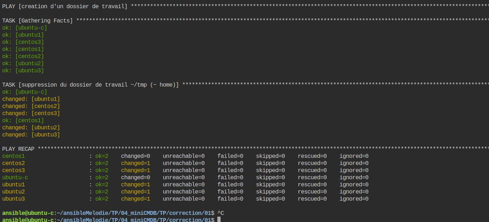  
si nous relançons nous devons avoir...
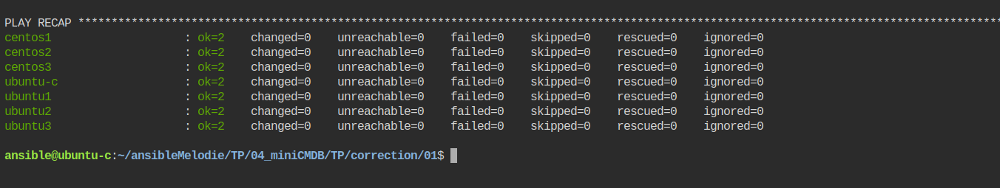  
nous sommes bien idempotent ! 
1. ajoutons une nouvelle tâche pour créer notre dossier
```yaml
    - name: creation du dossier de travail ~/tmp (~ home)
      file:
        state: directory
        path: ~/tmp
```  
    - lançons
   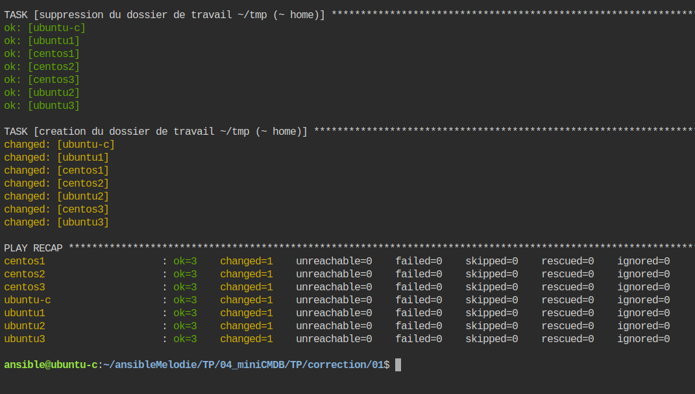  
    - relançons
   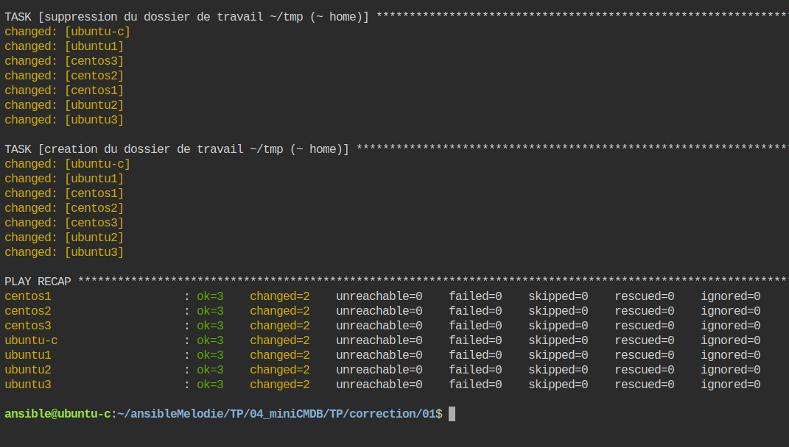  

[correction](../04_miniCMDB/TP/correction/01/)
### affichage des gather_facts
Nous allons créer 2 nouvelles tâches : 
- une pour afficher les gathers facts. 
- une autre pour afficher le nom du host (variable ansible)  

pour ce faire nous utiliserons le module `debug` que nous avons vu dans les TPs précédents.
1. ajout de l'affichage des gathers facts.
```yaml
    - name: affichage des gather_facts
      debug:
        var: ansible_facts                    
...
```
lançons ....
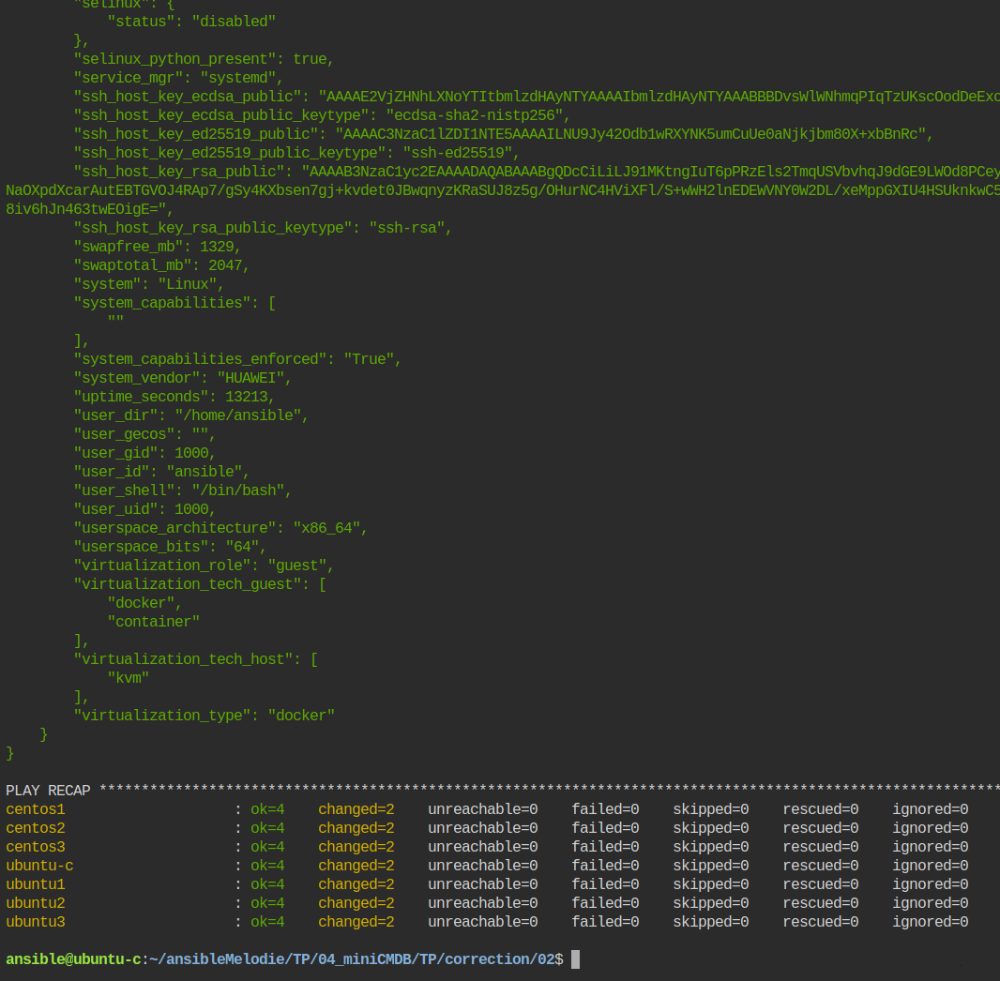  
Comme vous pouvez le constater Ansible collecte beaucoup beaucoup d'informations sur les machines.

1. ajout de l'affichage dun nom du host (hostName).
```yaml
    - name: affichage du nom de host
      debug:
        var: ansible_hostname  
...
```
lançons ....
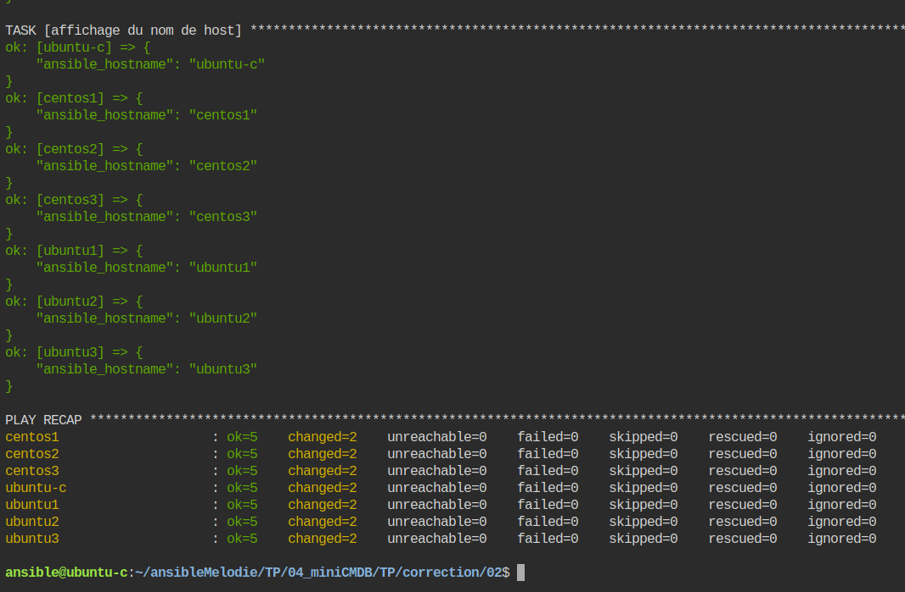  

[correction](../04_miniCMDB/TP/correction/02/)

### Génération du rapport en markdown.
Maintenant que nous un dossier et des infos nous allons utiliser un template pour "rapporter" ces informations sous la forme d'un document au format markdown.
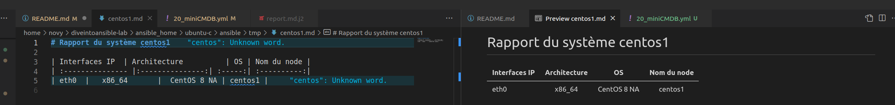  

1. création du template
Nous allons copier directement un dossier avec le template.
- copier le dossier via la commande.
`cp -R /home/ansible/ansibleMelodie/TP/04_miniCMDB/TP/correction/03/templates .`
- visualiser le fichier
    - il est écrit au format markdown mais cela pourrait être de l'html.
    - nos variables sont incluses avec la syntaxe {{ma_variable}}  
    `{{ ansible_default_ipv4.alias }} `
1. ajout de la tâche créant le rapport en se basant sur notre template et les informations collectées par ansible.   
le nouveau sera déposé dans notre répertoire de travail (~/tmp) et se nommera 
`{{ inventory_hostname }}.md` 
Remarquer l'usage des doubles accolades pour indiquer qu'il faut rempalcer par le contenu de la variable. 
```yaml
    - name: Génération du rapport en markdown 
      template:
        src: templates/report.md.j2
        dest: "~/tmp/{{ inventory_hostname }}.md"
```
lançons 
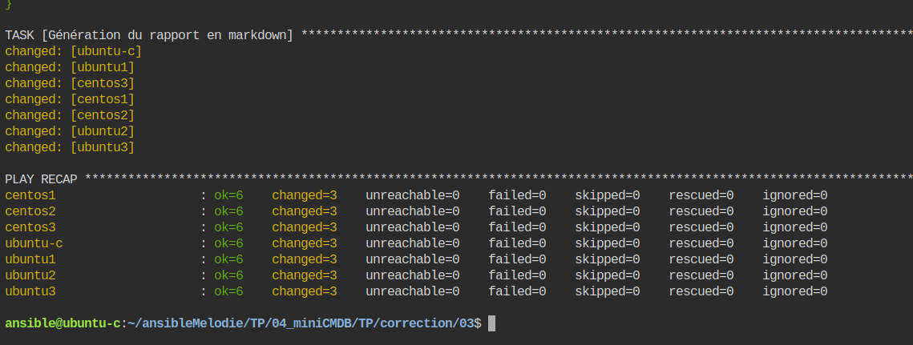    

1. consulter le rapport sur  `Centos1` via l’éditeur ou via la commande 
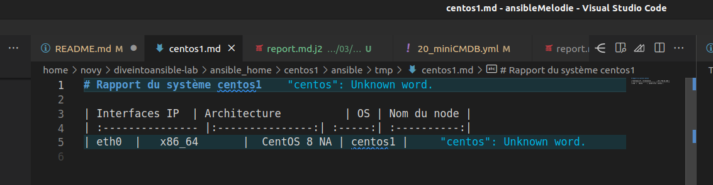 

### Collecte des rapports sur la machine de contrôle (`ubuntu-c`)
Nous allons devoir créer à nouveau jeu à notre playbook.
En effet nous ne devons porter nos actions que sur les machines managées et non sur toutes, puisque cela inclût la machine de contrôle.
1. Création d'un nouveau jeu avec la portée du groupe `managed` de notre inventaire.  
```yaml
- name: download des rapports des machines hôtes
  hosts: managed
  tasks: 
```
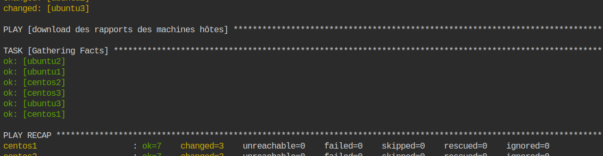  

la collecte des gathers facts ne sert à rien, supprimons cette tâche. 
ajoutons la clause 
`gather_facts: no`
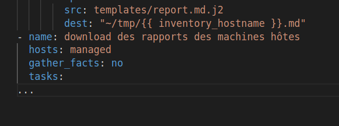  

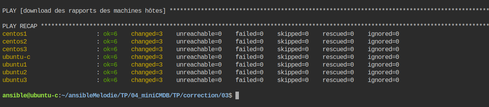  
1. ajout d'une tache à ce nouveau jeu pour rapatrier les rapports dans le dosseri é/tmp de la machine de contrôle.
```yaml
    - name: recup é/tmp/*.html ==> localhost ~/tmp
      fetch:
        src: "~/tmp/{{ inventory_hostname }}.md"
        dest: ~/tmp
        flat: true
        validate_checksum: false    
```
lançons
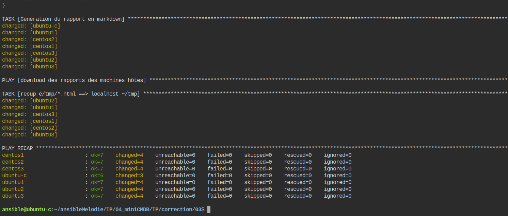  

contrôlons sur `ubuntu-c`
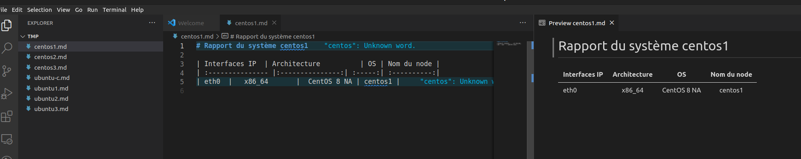  


## Conclusion et feed-back  

## Correction  


# 💡💡💡💡Idées 
- 