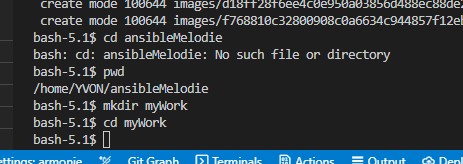

# Tutorial 5 Utiliser Ansible sur IBMi.    
## Table des matières
- [Objectifs](#objectifs)  
- [Ressources](#ressources)
- [Pré-Requis](#pré-requis)  
## Objectifs  
Dans ce TP ,nous allons utiliser Ansible sur notre IBMi.
Pour respecter des contraintes d'infrastructure,notre IBMi sera le noeud de contrôle et nous exécuterons des tâches sur lui même en utilisant une connection locale (comme ubuntu-c).

Pour ce faire nous avons de réaliser quelques manipulations et installations d'outils.


Ainsi nous allons : 
- Installer visual studio code sur votre poste client.
- Installer les différentes extensions nécessaires (code for IBMi) via un profile gist ?
- Ajouter un .profile et 
- Ajouter des tachés en nous aidant des modules pour :.bashrc pour configurer votre shell sur l'IBMi.
- Cloner le dépot ansibleMelodie sur votre home.
- Installer la collection ibmi sur votre home.
- Configurer Ansible (ansible.cfg) et tester via CLI.
- Creation d'un inventaire en localhost (group_vars python3) et Test via le CLI
- Appeler un playbook créé au chapitre précédant pour voir ...


## Ressources 
- Environnement 
- Temps : 60 mn.
## Pré-Requis
 


## Énoncé  
### Etape 1 Installer Visual Studio Code sur le poste client.
1. [Download Visual Studio Code](https://code.visualstudio.com/download)
1. lancer l'installation.
🧐lors de l'installation ,choisissez l'option pour avoir vsc en clic droit et le raccourci sur le bureau.
1. Ouvrer VSC et créer un dossier (ou vous voulez pour travailler)
  
  
  
  
  

### Etape 2 Installer code for IBMi.
1.installation des extensions via un profile.
[profile Ansible](https://vscode.dev/profile/github/89a0fbec81244d0efe56e9489c17f8fb)
  
  
  
  
  
1. connection à Armonie via code for IBMi
- lancer `code for IBMi`
  
  
connection name : `ceQueVousVoulez`
host ou IP: `178.255.128.61`
userName : `VotreProfilIBMi`
password : `votrePasswordIBMi`
savePassword : ok 
  
accepter le message précisant le changement de la bibliothèque courante
  

### mise en place de .profile et bashrc
1. Ouvrir une session shell 
  
`cp /home/YVON/.profile .`
verifiez avec `ls -a`
idem pour le fichier .bashrc
`cp /home/YVON/.bashrc .`
1. fermer ce terminal pase et rouvrez un nouveau terminal
  
1. tester en appelant l'aide de git
  
`git --help`

### créer le projet ansibleMelodie

1. cloner le depot ansibleMelodie de github
`git clone https://github.com/novy400/ansibleMelodie.git`  

si cela ne marche pas, passer par /tmp
et `mv ./ansibleMelodie /home/YVON/ansibleMelodie`

  

1. se placer dans  le dossier ansibleMelodie  

```
cd ansibleMelodie
git pull 
```
1. créer un dossier myWork 
`mkdir mywork ; cd myWork`
  

1. créer un dossier TP05 pour notre projet.  
`mkdir TP05 ; cd TP05`
1. création d'un raccourci dans code for IBMi.
Dans la partie `IFS BROWSER` de COde for IBMI.
- deployer le dossier home (/home/VOTREPROFIL)
- cliquer droit sur le dossier ansibleMelodie 
- ajouter un raccourci
  
-confirmer par la touche entree
  
  


### Configurer ansible
1. tester la configuration existante via les commandes CLI 
`ansible --version`  
ou  
`ansible-config --version`
  
`ansible-config view`
  

1. Création de ansible.cfg dans notre projet 
- copier le fichier ansible.cfg (/TP/05_helloIBMi/ressources/ansible.cfg).  
  
- indiquer le nouveau chemin  
`/home/YVON/ansibleMelodie/myWork/TP05/ansible.cfg`
  
puis entree

- tester la configuration  
    - `ansible-config --version`
  

1. creation de l'inventaire
Nous réaliserons tous nos tests sur une seule machine en local.
Donc nous n'allons configurer que le control node qui sera auto consommé en local (sasn ssh) 
- copier le fichier 00_inventory.yml (TP\05_helloIBMi\ressources\00_inventory.yml). 
- tester l'inventaire 
`ansible-inventory -i 00_inventory.yml --graph`
  
`ansible -i 00_inventory.yml all -m ping` 
  

Comme vous pouvez le remarquer nous avons un petit soucis de configuration de l'interpreteur python, c'est souvent le cas sur l'IBMi mais nous allons corriger en précisant l'usage de ce python pour ce host via une variable d'inventaire.
  
1. création d'une variable d'inventaire.
    - ajout du dossier `/group_vars` puis  `/all` dans celui-ci
  
  
  
    - ajout d'un fichier variables.yml dans ./TP05/group_vars/all  
  
    - ajout de la variable
    `ansible_python_interpreter: /QOpenSys/pkgs/bin/python3.6`
    - testons un ping  
    `ansible -i 00_inventory.yml all -m ping`  
  

### un premier playbook ?
nous allons lancer un playbook du TP03.
pour afficher le contenu d'une variable d'inventaire et créer un dossier tmp.
1. ajout de la variable maVariable dans l'inventaire.
    - ouvrez le fichier variables.yml de `/home/YVON/ansibleMelodie/myWork/TP05/group_vars/all/variables.yml`
    - ajouter la ligne  
    `maVariable: all`
1. copie du playbook du TP03 dans notre projet  
`/home/YVON/ansibleMelodie/TP/03_PremierPlaybook/TP/correction/03/10_premierPlaybook.yml`  
  
dans 
`/home/YVON/ansibleMelodie/myWork/TP05/10_premierPlaybook.yml`
1. testons 
`ansible-playbook 10_premierPlaybook.yml -i 00_inventory.yml`  
  

Nous devons modifié notre playbook , nous n'avons plus de group `managed`
1. modification du playbook 
```yaml
---
- name: tests de notre configuration.
  hosts: all
  tasks:
   - name: test de la connexion
     ping:
   - name: affichage d'un message avec ma variable.
     debug:
      msg: Le contenu de ma variable est {{ maVariable }}. 

- name: creation d'un dossier ~/tmp.
  hosts: managed
  tasks:
    - name: ajout du dossier.
      file:
        state: directory
        path: ~/tmp            
...
```
devient  
```yaml
---
---
- name: tests de notre configuration.
  hosts: all
  tasks:
   - name: test de la connexion
     ping:
   - name: affichage d'un message avec ma variable.
     debug:
      msg: Le contenu de ma variable est {{ maVariable }}. 
   - name: ajout du dossier.
     file:
      state: directory
      path: ~/tmp            
...
```
1. relançons
  
vérifions  
  

[correction](../05_helloIBMi/TP/correction/01/)

### la miniCMDB ? 
1. copie du playbook [TP\04_miniCMDB\TP\correction\03\20_miniCMDB.yml](../04_miniCMDB/TP/correction/03/20_miniCMDB.yml)
1. copie du dossier avec la template [TP\04_miniCMDB\TP\correction\03\templates](../04_miniCMDB/TP/correction/03/templates/)
1. modification playbook
Nous n'avons qu'une seule machine donc nous pouvons supprimer le jeu pour la partie `managed`
```
- name: download des rapports des machines hôtes
  hosts: managed
  gather_facts: no  
  tasks:  
    - name: recup é/tmp/*.html ==> localhost ~/tmp
      fetch:
        src: "~/tmp/{{ inventory_hostname }}.md"
        dest: ~/tmp
        flat: true
        validate_checksum: false                       
...
```
1. lançons
  
ça ne marche pas .
  
1. modifions notre template
- supprimons la variable
{{ ansible_default_ipv4.alias }} 
{{ ansible_distribution_major_version }}
notre template devient 
```md
# Rapport du système {{ inventory_hostname }}

| Interfaces IP  | Architecture          | OS | Nom du node |
| :--------------- |:---------------:| :-----:| :----------:|
| non definie   |   {{ ansible_architecture }}       |  {{ ansible_distribution }}  {{ ansible_distribution_release }} | {{ ansible_nodename }} | 
```
1. relançons
  
  

[correction](../05_helloIBMi/TP/correction/02/)
## Conclusion et feed-back  

## Correction  


# 💡💡💡💡Idées 
- 