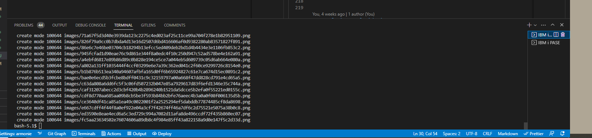
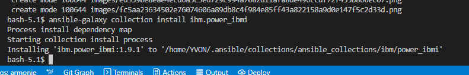
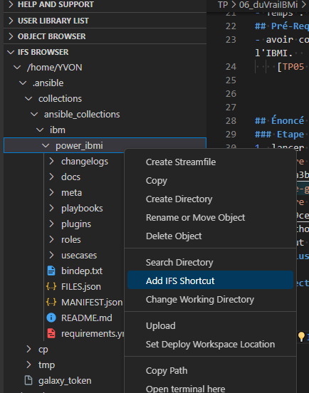
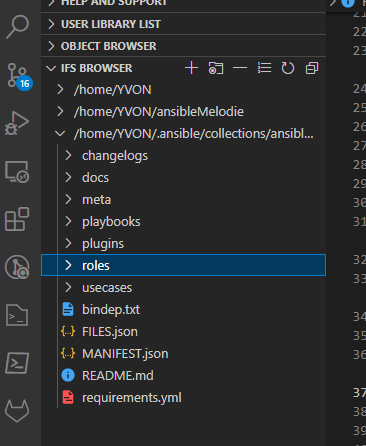
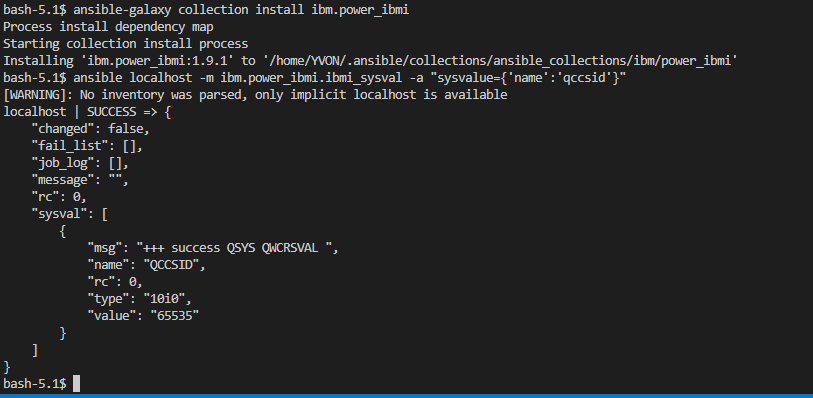
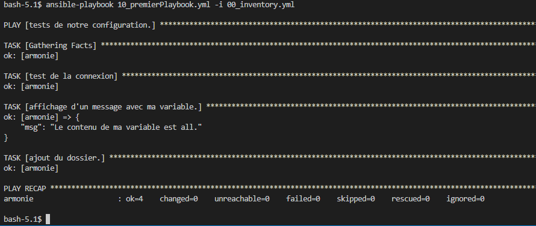
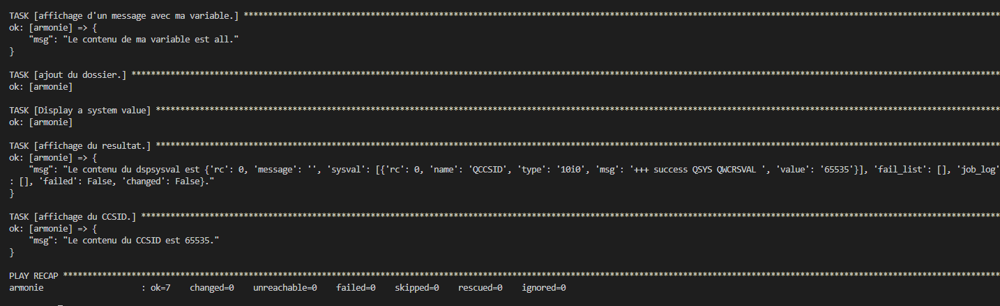
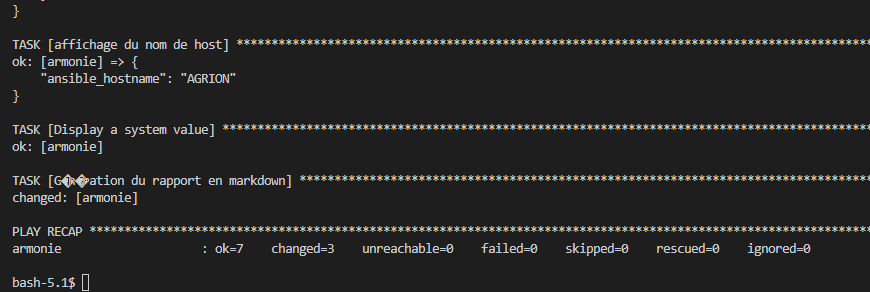
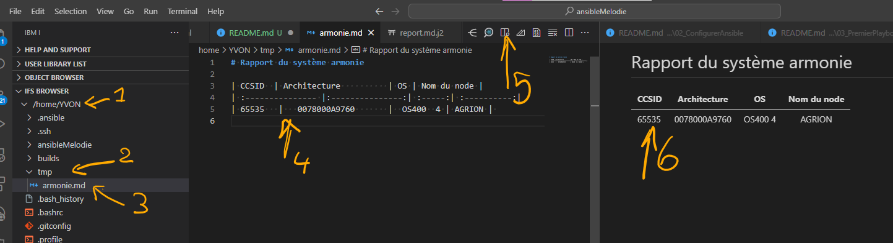

# Tutorial 5 Utiliser Ansible sur IBMi.    
## Table des matières
- [Objectifs](#objectifs)  
- [Ressources](#ressources)
- [Pré-Requis](#pré-requis)  
## Objectifs  
Dans ce TP ,nous allons utiliser Ansible sur notre IBMi.
Contrairement au TP précédant nous allons spécialiser nos tâches à réaliser en installant des modules spécifiques à l'IBMi via la collection disponible sur galaxy.

Ainsi nous allons : 
- Installation de la Collection Ansible pour IBM i
- Configuration de la Collection Ansible pour IBM i
- Test via le CLI => dspsysval ?? 
- modifier le Playbook précédant miniCMDB pour afficher le ccsid. 
- Analyser les résultats


## Ressources 
- Environnement 
- Temps : 60 mn.
## Pré-Requis
- avoir configurer Ansible pour travailler avec notre l'environnement sur l'IBMI.  
    [TP05 - Hello IBMi](../05_helloIBMi/README.md)  


## Énoncé  
### Etape 1 Installer la Collection Ansible pour IBM i.
1. lancer la commande suivante dans un terminal IBMi.
  
`ansible-galaxy collection install ibm.power_ibmi`
  
1. affichons le contenu de cette collection dans le browser IFS de C4I
Cela peut être pratique de ce créer dans le même temps un raccourci.
  
  
1. testons en appelant un module de cette collection via le CLI d'ansible.
`ansible localhost -m ibm.power_ibmi.ibmi_sysval -a "sysvalue={'name':'qccsid'}"`
  

### Etape 2 utiliser la Collection Ansible pour IBM i dans un playbook.
1. Créons le dossier TP06 dans myWork en recopiant le dossier TP05.
1. Dans le playbook 10_premierPlaybook.yml, ajoutons l'usage des modules de notre collection
```yaml
---
- name: tests de notre configuration.
  hosts: all
  tasks:
   - name: test de la connexion
     ping:
   - name: affichage d'un message avec ma variable.
     debug:
      msg: Le contenu de ma variable est {{ maVariable }}. 
   - name: ajout du dossier.
     file:
      state: directory
      path: ~/tmp            
...
```
devient 
```yaml
---
- name: tests de notre configuration.
  hosts: all
  collections:
   - ibm.power_ibmi  
  tasks:
   - name: test de la connexion
     ping:
   - name: affichage d'un message avec ma variable.
     debug:
      msg: Le contenu de ma variable est {{ maVariable }}. 
   - name: ajout du dossier.
     file:
      state: directory
      path: ~/tmp            
...
```
  - testons
    `ansible-playbook 10_premierPlaybook.yml -i 00_inventory.yml` 
    ok mais rien de neuf ! mais on n'a rien cassé ! 
      
1. ajoutons une tâche utilisant un module de l'IBMi.
```yaml
   - name: Display a system value
     ibmi_sysval:
      sysvalue:
        - {'name':'qccsid'}
     register: dspsysval_ccsid_result    
   - name: affichage du resultat.
     debug:
      msg: Le contenu du dspsysval est {{ dspsysval_ccsid_result }}. 
   - name: affichage du CCSID.
     debug:
      msg: Le contenu du CCSID est {{ dspsysval_ccsid_result.sysval[0].value }}. 
```  
  

[correction](../06_duVraiIBMi/TP/correction/01/)

### Etape 2 adapter notre miniCMDB pour afficher aussi le CCSID.
1. modifier le playbook 20_miniCMDB.yml
  - Ajout de la collection IBMi.
  ```yaml
  ---
- name: creation d'un dossier de travail
  hosts: all
  collections:
   - ibm.power_ibmi  
  ```

  - Ajout de la tâche collectant le CCSID.
  ```yaml
      - name: Display a system value
        ibmi_sysval:
          sysvalue:
            - {'name':'qccsid'}
        register: dspsysval_ccsid_result    
  ```
  juste avant la tache de Génération du rapport en markdown 

  -testons
    `ansible-playbook 20_miniCMDB.yml -i 00_inventory.yml` 
    ok mais notre variable n'est pas reportée dans notre rapport ? 
1. ajoutons le CCSID dans notre rapport 
- modification de notre template  (./TP06/templates/report.md.j2) 
```markdown
# Rapport du système {{ inventory_hostname }}

| CCSID  | Architecture          | OS | Nom du node |
| :--------------- |:---------------:| :-----:| :----------:|
| {{ dspsysval_ccsid_result.sysval[0].value }}   |   {{ ansible_architecture }}       |  {{ ansible_distribution }}  {{ ansible_distribution_release }} | {{ ansible_nodename }} | 

``` 
1. lançons et vérifions.
  

  

[correction](../06_duVraiIBMi/TP/correction/02/)

## Conclusion et feed-back  

## Correction  


# 💡💡💡💡Idées 
- 