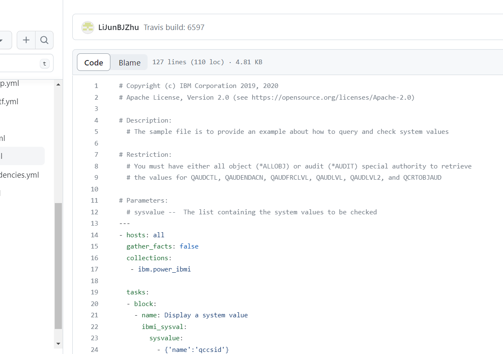

# Tutorial 7 Utiliser les exemples de Github.    
## Table des matières
- [Objectifs](#objectifs)  
- [Ressources](#ressources)
- [Pré-Requis](#pré-requis)  
## Objectifs  
Dans ce TP ,nous allons utiliser les exemples fournis avec la collection Ibmi ansible.Ansible sur notre IBMi.
Pour rappel :
- [site Github](https://github.com/IBM/ansible-for-i/tree/devel)
- [doc reference](https://ibm.github.io/ansible-for-i/index.html)
Ainsi nous allons : 
- utiliser l'exemple [ibmi-sysval-sample.yml](https://github.com/IBM/ansible-for-i/blob/devel/playbooks/ibmi-sysval-sample.yml) 
- utiliser l'exemple [ibmi-cl-command-sample.yml](https://github.com/IBM/ansible-for-i/blob/devel/playbooks/ibmi-cl-command-sample.yml) en utilisant une variable d'inventaire pour le nom de la bibliothéque
- Analyser les résultats

⚠⚠ attention Nous allons utiliser des ressources que nous n'avons pas écrites ! 
Il est trés utile de lire ces ressources avant de les lancer sur une machine mais si celle_çi se trouve être une machine de test.

## Ressources 
- Environnement 
- Temps : 60 mn.
## Pré-Requis
- avoir configurer Ansible pour travailler avec notre l'environnement sur l'IBMI.  
    [TP05 - Hello IBMi](../05_helloIBMi/README.md)  
- avoir installer la collectionIBMi.  
    [TP06 - Du vrai IBMi](../06_duVraiIBMi/README.md)    

## Énoncé  
### Etape 1 créer le projet TP07 en dupliquant le dossier TP06
### Etape 2 ibmi-sysval-sample.yml.
1. Trouver l'exemple.
  - sur github.
  [site Github](https://github.com/IBM/ansible-for-i/tree/devel)
    
  
  

  - sur la machine dans la collection.
  Utiliser le lien défini sur la collection dans le browser IFS de C4I.
    
  
1. dupliquer le playbook dans votre projet si il vous convient.
plusieurs façons de faire copie du fichier via le browser IFS (clic droit su le fichier)
ou création d'un nouveau fichier dans le projet et CTRL-a CTRL-c sur la source et ctrl-a CTRL-V sur la cible 
  
  
  

1. Contrôler sa possible execution  
  - Lancer en check ,diff ...
    - diff
`ansible-playbook 30_controleValeursSystemes.yml -i 00_inventory.yml --diff` 
    -check diff
    `ansible-playbook 30_controleValeursSystemes.yml -i 00_inventory.yml --check` 
    modifier les valeurs testées dans le playbook pour qu'ils passent les controles.
    ⚠ NE PAS MODIFIER LES VALEURS SYSTEMES DE LA MACHINE !!!
  - Lancer pas à pas 
  `ansible-playbook 30_controleValeursSystemes.yml -i 00_inventory.yml --step`
1. ajouter la clause `ignore_errors: true` pour laisser passer les controles ko  
1. Lancer en global 
 `ansible-playbook 30_controleValeursSystemes.yml -i 00_inventory.yml`
 [correction](./TP/correction/01/)

### Etape 2 ibmi-cl-command-sample.yml.

objectif créer une bibliothèque avec un nom de la variable d'inventaire `nomLIBTravail` .
1. Trouver l'exemple.
  - sur github.
  [site Github](https://github.com/IBM/ansible-for-i/tree/devel)
    
  
  

  - sur la machine dans la collection.
  Utiliser le lien défini sur la collection dans le browser IFS de C4I.
  
1. dupliquer le playbook dans votre projet si il vous convient.
plusieurs façons de faire copie du fichier via le browser IFS (clic droit su le fichier)
ou création d'un nouveau fichier dans le projet et CTRL-a CTRL-c sur la source et ctrl-a CTRL-V sur la cible 
  
  
  
1. ajouter la variable d'inventaire et modifier le playbook pour qu'il en tienne compte.
1. Contrôler sa possible execution  
  - Lancer en check ,diff ...
    - diff
`ansible-playbook 40_creationLibTravail.yml -i 00_inventory.yml --diff` 
    -check diff
    `ansible-playbook 40_creationLibTravail.yml -i 00_inventory.yml --check` 
    modifier les valeurs testées dans le playbook pour qu'ils passent les controles.
    ⚠ NE PAS MODIFIER LES VALEURS SYSTEMES DE LA MACHINE !!!
  - Lancer pas à pas 
  `ansible-playbook 40_creationLibTravail.yml -i 00_inventory.yml --step`
 
1. Lancer en global 
 `ansible-playbook 40_creationLibTravail.yml -i 00_inventory.yml`
 relancer 
 [correction](./TP/correction/02/) 
## Conclusion et feed-back  

## Correction  

# 💡💡💡💡Idées 
- 